# TICKET_DATABASE.md
## CareFollow Platform — Ticket Bounded Context: Database Design

**Version:** 1.0.0
**Status:** DRAFT — Pending DDD_MODEL.md confirmation
**Scope:** `ticket` PostgreSQL schema only
**Date:** 2026-06-01

> **Source Notice:** Reverse-engineered from `src/model/ticket*/`, `src/services/TicketService.ts`, `src/services/SupportCommonService.ts`, `src/pages/Ticket/`, and `src/configs/urls.ts`. All claims are tagged **CONFIRMED**, **INFERRED**, or **UNKNOWN**. DDD_MODEL.md is required to resolve every UNKNOWN before production migration.

---

## Table of Contents

1. [Aggregate Analysis](#1-aggregate-analysis)
2. [ERD — Mermaid](#2-erd--mermaid)
3. [SQL DDL](#3-sql-ddl)
4. [Index Strategy](#4-index-strategy)
5. [Prisma Schema](#5-prisma-schema)
6. [Unknown Registry](#6-unknown-registry)

---

## 1. Aggregate Analysis

### 1.1 Context Boundary

The **Ticket context** (`ticket` schema) owns all entities related to customer support requests, their routing through multi-step approval procedures, and the execution log of each procedure step.

**Out of scope for this context:**

| Concept | Belongs To |
|---|---|
| Customer / Patient profile | `customer` schema |
| User identity, departments | `iam` schema |
| Warranty (bảo hành) | `warranty` schema — separate context |
| BPM workflow engine | `bpm` schema |

**Cross-context UUID references (no FK constraints):**

| Column | Target Context | Target Entity |
|---|---|---|
| `tickets.customer_id` | `customer` | `patients` |
| `tickets.iam_employee_id` | `iam` | `users` (assigned employee) |
| `tickets.iam_creator_id` | `iam` | `users` (creator) |
| `tickets.iam_executor_id` | `iam` | `users` (executor) |
| `tickets.iam_department_id` | `iam` | `departments` (receiving dept) |
| `ticket_procedure_steps.iam_department_id` | `iam` | `departments` |
| `ticket_procedure_step_assignees.iam_user_id` | `iam` | `users` |
| `support_objects.iam_assignee_id` | `iam` | `users` |
| `support_logs.iam_actor_id` | `iam` | `users` |
| `ticket_exchanges.iam_author_id` | `iam` | `users` |

---

### 1.2 Aggregate Map

```
ticket schema
│
├── [AG-01] Ticket Aggregate
│   ├── Root:     tickets
│   ├── Entities: ticket_exchanges   (chat / internal messages)
│   │             ticket_viewers     (access control list)
│   └── Invariants:
│         • status transitions: 0→1→2, 1→4, 4→1, any→3 (cancel) [CONFIRMED from UI]
│         • endDate must be ≥ startDate [INFERRED]
│         • customerId OR phone must be provided [INFERRED]
│         • A ticket may link to at most one ticket_procedure (supportId) [CONFIRMED]
│         • ticket cannot change procedure after initialization (updateAndInit) [UNKNOWN-01]
│
├── [AG-02] TicketProcedure Aggregate  (quy trình hỗ trợ)
│   ├── Root:     ticket_procedures      (maps to /support API)
│   ├── Entities: ticket_procedure_steps (maps to /ticketStep API)
│   │             ticket_procedure_links (maps to /supportLink API — graph edges)
│   │             ticket_procedure_step_assignees (normalized from employees JSON)
│   │             support_configs        (maps to /supportConfig API)
│   └── Invariants:
│         • A procedure must have exactly one Start node (departmentId=0) [CONFIRMED]
│         • A procedure must have at least one End node (departmentId=-1) [CONFIRMED]
│         • A procedure may have one Reject node (departmentId=-2) [CONFIRMED]
│         • step.period + step.unit define the SLA duration for that step [INFERRED]
│         • divisionMethod controls employee assignment strategy [UNKNOWN-02]
│         • An active procedure cannot have its steps modified [UNKNOWN-03]
│
├── [AG-03] SupportExecution Aggregate  (instance of procedure running on a ticket)
│   ├── Root:     support_objects  (maps to /supportObject API — step assignment instance)
│   ├── Entities: support_logs     (maps to /supportLog API — action audit trail)
│   └── Invariants:
│         • Created when ticket.updateAndInit is called [CONFIRMED]
│         • One SupportObject per procedure step per ticket [INFERRED]
│         • SupportLog status: 0=pending, 1=in_progress, 2=done, 3=rejected [CONFIRMED]
│         • Actions: receive (0→1), processDone (1→2), processRejected (1→3) [CONFIRMED]
│         • resetTransferVotes resets a support_object back to pending state [CONFIRMED]
│         • Only the assigned employee may act on their SupportObject [UNKNOWN-04]
│
├── [AG-04] TicketCategory Aggregate  (reference data)
│   ├── Root:     ticket_categories
│   └── Invariants:
│         • type is an integer discriminator [UNKNOWN-05]
│         • name must be unique per tenant per type [INFERRED]
│
└── [AG-05] QRCode Aggregate  (customer intake QR codes)
    ├── Root:     qr_codes
    └── Invariants:
          • code must be globally unique per tenant [INFERRED]
          • A QRCode may have a validity window (startDate / endDate) [CONFIRMED]
          • link is the URL encoded in the QR image [CONFIRMED]
```

---

### 1.3 Key Domain Concepts

| Vietnamese Term | English DDD Term | Confirmed |
|---|---|---|
| Phiếu yêu cầu | Ticket | CONFIRMED |
| Quy trình hỗ trợ | TicketProcedure | CONFIRMED |
| Bước xử lý | ProcedureStep | CONFIRMED |
| Liên kết bước | ProcedureLink (graph edge) | INFERRED |
| Phân công xử lý | SupportObject (step instance) | CONFIRMED |
| Nhật ký xử lý | SupportLog (execution log) | CONFIRMED |
| Trao đổi phiếu | TicketExchange (internal chat) | CONFIRMED |
| Danh mục phiếu | TicketCategory | CONFIRMED |
| Cấu hình quy trình | SupportConfig | UNKNOWN-06 |

### 1.4 Status Reference (CONFIRMED from UI source code)

**Ticket status (`tickets.status`):**

| Value | Label (VN) | Label (EN) |
|---|---|---|
| `0` | Chưa thực hiện | Not started |
| `1` | Đang thực hiện | In progress |
| `2` | Đã hoàn thành | Completed |
| `3` | Đã hủy | Cancelled |
| `4` | Tạm dừng | Paused |

**SupportLog status (`support_logs.status`):**

| Value | Label (VN) | Label (EN) |
|---|---|---|
| `0` | Chờ tiếp nhận | Pending receipt |
| `1` | Đang thực hiện | In progress |
| `2` | Hoàn thành | Done |
| `3` | Hủy / Từ chối | Cancelled / Rejected |

**ProcedureStep node type (special `department_id` values):**

| Special Value | Meaning |
|---|---|
| `0` (iam_dept_id = NULL, type = `start`) | Start node |
| `-1` (iam_dept_id = NULL, type = `end`) | End / Complete node |
| `-2` (iam_dept_id = NULL, type = `reject`) | Reject node |
| Any UUID | Regular department step |

---

## 2. ERD — Mermaid

```mermaid
erDiagram

  %% ─── AG-04: TicketCategory (reference — define first) ──────
  ticket_categories {
    uuid        id               PK
    uuid        tenant_id
    varchar(255) name
    smallint    type
    integer     position
    timestamptz created_at
    uuid        created_by
    timestamptz updated_at
    uuid        updated_by
    timestamptz deleted_at
    uuid        deleted_by
    integer     row_version
  }

  %% ─── AG-05: QRCode ─────────────────────────────────────────
  qr_codes {
    uuid        id               PK
    uuid        tenant_id
    varchar(100) name
    varchar(100) code            UK
    varchar(1000) link
    date        start_date
    date        end_date
    timestamptz created_at
    uuid        created_by
    timestamptz updated_at
    uuid        updated_by
    timestamptz deleted_at
    uuid        deleted_by
    integer     row_version
  }

  %% ─── AG-02: TicketProcedure ────────────────────────────────
  ticket_procedures {
    uuid        id               PK
    uuid        tenant_id
    varchar(255) name
    integer     position
    date        start_date
    date        end_date
    uuid        iam_branch_id    "→iam.branches"
    smallint    status
    timestamptz created_at
    uuid        created_by
    timestamptz updated_at
    uuid        updated_by
    timestamptz deleted_at
    uuid        deleted_by
    integer     row_version
  }

  ticket_procedure_steps {
    uuid        id               PK
    uuid        tenant_id
    uuid        procedure_id     FK
    uuid        prev_step_id     "self-ref FK"
    varchar(20) step_type        "start|department|end|reject"
    uuid        iam_department_id "→iam.departments"
    integer     period
    varchar(20) unit             "hour|day|week"
    smallint    division_method
    integer     position
    timestamptz created_at
    uuid        created_by
    timestamptz updated_at
    uuid        updated_by
    timestamptz deleted_at
    uuid        deleted_by
    integer     row_version
  }

  ticket_procedure_step_assignees {
    uuid        id               PK
    uuid        tenant_id
    uuid        step_id          FK
    uuid        iam_user_id      "→iam.users"
    integer     rank
    timestamptz created_at
    uuid        created_by
    timestamptz deleted_at
  }

  ticket_procedure_links {
    uuid        id               PK
    uuid        tenant_id
    uuid        procedure_id     FK
    uuid        from_step_id     FK
    uuid        to_step_id       FK
    jsonb       condition
    timestamptz created_at
    uuid        created_by
    timestamptz deleted_at
  }

  support_configs {
    uuid        id               PK
    uuid        tenant_id
    uuid        procedure_id     FK
    varchar(100) config_key
    text        config_value
    timestamptz created_at
    uuid        created_by
    timestamptz updated_at
    uuid        updated_by
    timestamptz deleted_at
    uuid        deleted_by
  }

  %% ─── AG-01: Ticket ─────────────────────────────────────────
  tickets {
    uuid        id               PK
    uuid        tenant_id
    varchar(50) code             UK
    varchar(255) name
    uuid        customer_id      "→customer.patients (uuid only)"
    varchar(50) customer_phone
    varchar(255) customer_email
    varchar(500) customer_address
    uuid        iam_employee_id  "→iam.users (assigned)"
    uuid        iam_creator_id   "→iam.users (creator)"
    uuid        iam_executor_id  "→iam.users (executor)"
    uuid        iam_department_id "→iam.departments"
    uuid        procedure_id     FK
    uuid        category_id      FK
    smallint    status
    text        content
    text        content_delta
    jsonb       doc_links
    varchar(50) phone
    date        start_date
    date        end_date
    timestamptz created_at
    uuid        created_by
    timestamptz updated_at
    uuid        updated_by
    timestamptz deleted_at
    uuid        deleted_by
    integer     row_version
  }

  ticket_exchanges {
    uuid        id               PK
    uuid        tenant_id
    uuid        ticket_id        FK
    uuid        iam_author_id    "→iam.users"
    text        content
    text        content_delta
    jsonb       media_urls
    jsonb       reader_ids
    timestamptz created_at
    timestamptz updated_at
    uuid        updated_by
    timestamptz deleted_at
    uuid        deleted_by
  }

  ticket_viewers {
    uuid        id               PK
    uuid        tenant_id
    uuid        ticket_id        FK
    uuid        iam_user_id      "→iam.users"
    timestamptz created_at
  }

  %% ─── AG-03: SupportExecution ────────────────────────────────
  support_objects {
    uuid        id               PK
    uuid        tenant_id
    uuid        ticket_id        FK
    uuid        step_id          FK
    uuid        iam_assignee_id  "→iam.users"
    smallint    status
    boolean     is_approved
    timestamptz assigned_at
    timestamptz due_at
    timestamptz created_at
    uuid        created_by
    timestamptz updated_at
    uuid        updated_by
    timestamptz deleted_at
    uuid        deleted_by
    integer     row_version
  }

  support_logs {
    uuid        id               PK
    uuid        tenant_id
    uuid        support_object_id FK
    uuid        step_id          FK
    uuid        iam_actor_id     "→iam.users"
    smallint    action
    smallint    status
    text        note
    timestamptz occurred_at
    uuid        created_by
    timestamptz deleted_at
    uuid        deleted_by
  }

  %% ─── Relationships ───────────────────────────────────────────
  ticket_procedures           ||--o{ ticket_procedure_steps     : "defines"
  ticket_procedure_steps      ||--o| ticket_procedure_steps     : "prev_step"
  ticket_procedure_steps      ||--o{ ticket_procedure_step_assignees : "assigns"
  ticket_procedures           ||--o{ ticket_procedure_links     : "connects"
  ticket_procedure_links      }o--|| ticket_procedure_steps     : "from"
  ticket_procedure_links      }o--|| ticket_procedure_steps     : "to"
  ticket_procedures           ||--o{ support_configs            : "configures"
  ticket_categories           ||--o{ tickets                    : "classifies"
  ticket_procedures           ||--o{ tickets                    : "governs"
  tickets                     ||--o{ ticket_exchanges           : "logs"
  tickets                     ||--o{ ticket_viewers             : "grants"
  tickets                     ||--o{ support_objects            : "instantiates"
  ticket_procedure_steps      ||--o{ support_objects            : "instantiated-by"
  support_objects             ||--o{ support_logs               : "records"
```



---

## 3. SQL DDL

```sql
-- ============================================================
-- TICKET SCHEMA BOOTSTRAP
-- ============================================================
CREATE SCHEMA IF NOT EXISTS ticket;

-- ============================================================
-- AG-04: TicketCategory
-- ============================================================
CREATE TABLE ticket.ticket_categories (
    id           UUID         NOT NULL DEFAULT gen_random_uuid(),
    tenant_id    UUID         NOT NULL,
    name         VARCHAR(255) NOT NULL,
    type         SMALLINT     NOT NULL DEFAULT 0,  -- UNKNOWN-05: enum values
    position     INTEGER      NOT NULL DEFAULT 0,
    created_at   TIMESTAMPTZ  NOT NULL DEFAULT now(),
    created_by   UUID         NOT NULL,
    updated_at   TIMESTAMPTZ  NOT NULL DEFAULT now(),
    updated_by   UUID         NOT NULL,
    deleted_at   TIMESTAMPTZ,
    deleted_by   UUID,
    row_version  INTEGER      NOT NULL DEFAULT 1,

    CONSTRAINT pk_ticket_categories PRIMARY KEY (id)
);

COMMENT ON TABLE  ticket.ticket_categories  IS 'AG-04: Reference data — ticket type/category labels per tenant.';
COMMENT ON COLUMN ticket.ticket_categories.type IS 'UNKNOWN-05: integer discriminator — values not confirmed in DDD_MODEL.md.';

-- ============================================================
-- AG-05: QRCode (customer intake)
-- ============================================================
CREATE TABLE ticket.qr_codes (
    id           UUID          NOT NULL DEFAULT gen_random_uuid(),
    tenant_id    UUID          NOT NULL,
    name         VARCHAR(100)  NOT NULL,
    code         VARCHAR(100)  NOT NULL,
    link         VARCHAR(1000) NOT NULL,
    start_date   DATE,
    end_date     DATE,
    created_at   TIMESTAMPTZ   NOT NULL DEFAULT now(),
    created_by   UUID          NOT NULL,
    updated_at   TIMESTAMPTZ   NOT NULL DEFAULT now(),
    updated_by   UUID          NOT NULL,
    deleted_at   TIMESTAMPTZ,
    deleted_by   UUID,
    row_version  INTEGER       NOT NULL DEFAULT 1,

    CONSTRAINT pk_qr_codes PRIMARY KEY (id),
    CONSTRAINT uq_qr_codes_code UNIQUE (tenant_id, code),
    CONSTRAINT ck_qr_codes_dates
        CHECK (end_date IS NULL OR start_date IS NULL OR end_date >= start_date)
);

COMMENT ON TABLE  ticket.qr_codes IS 'AG-05: QR codes for customer-facing ticket intake (JSSDK collect endpoint).';
COMMENT ON COLUMN ticket.qr_codes.link IS 'URL encoded inside the QR image. Points to the intake form.';

-- ============================================================
-- AG-02: TicketProcedure (quy trình hỗ trợ)
-- ============================================================
CREATE TABLE ticket.ticket_procedures (
    id             UUID         NOT NULL DEFAULT gen_random_uuid(),
    tenant_id      UUID         NOT NULL,
    name           VARCHAR(255) NOT NULL,
    position       INTEGER      NOT NULL DEFAULT 0,
    start_date     DATE,
    end_date       DATE,
    iam_branch_id  UUID,                  -- → iam.branches (cross-context, no FK)
    status         SMALLINT     NOT NULL DEFAULT 0,  -- UNKNOWN-07: procedure status values
    created_at     TIMESTAMPTZ  NOT NULL DEFAULT now(),
    created_by     UUID         NOT NULL,
    updated_at     TIMESTAMPTZ  NOT NULL DEFAULT now(),
    updated_by     UUID         NOT NULL,
    deleted_at     TIMESTAMPTZ,
    deleted_by     UUID,
    row_version    INTEGER      NOT NULL DEFAULT 1,

    CONSTRAINT pk_ticket_procedures PRIMARY KEY (id)
);

COMMENT ON TABLE  ticket.ticket_procedures IS 'AG-02: Procedure definition template (maps to /support API). A Ticket references one procedure.';
COMMENT ON COLUMN ticket.ticket_procedures.iam_branch_id IS 'Cross-context ref → iam.branches.id. No FK constraint.';
COMMENT ON COLUMN ticket.ticket_procedures.status IS 'UNKNOWN-07: procedure active/inactive status values not confirmed.';

-- ============================================================
-- AG-02: TicketProcedureStep (bước xử lý)
-- step_type replaces the legacy special departmentId sentinel values:
--   old 0   → step_type = 'start'
--   old -1  → step_type = 'end'
--   old -2  → step_type = 'reject'
--   other   → step_type = 'department'  (iam_department_id carries the real dept UUID)
-- ============================================================
CREATE TABLE ticket.ticket_procedure_steps (
    id                UUID         NOT NULL DEFAULT gen_random_uuid(),
    tenant_id         UUID         NOT NULL,
    procedure_id      UUID         NOT NULL,
    prev_step_id      UUID,                   -- self-ref within same procedure
    step_type         VARCHAR(20)  NOT NULL
                          CHECK (step_type IN ('start', 'department', 'end', 'reject')),
    iam_department_id UUID,                   -- → iam.departments (NULL for start/end/reject)
    period            INTEGER,                -- SLA duration value
    unit              VARCHAR(20)  CHECK (unit IN ('hour', 'day', 'week') OR unit IS NULL),
    division_method   SMALLINT,               -- UNKNOWN-02: assignment strategy values
    position          INTEGER      NOT NULL DEFAULT 0,
    created_at        TIMESTAMPTZ  NOT NULL DEFAULT now(),
    created_by        UUID         NOT NULL,
    updated_at        TIMESTAMPTZ  NOT NULL DEFAULT now(),
    updated_by        UUID         NOT NULL,
    deleted_at        TIMESTAMPTZ,
    deleted_by        UUID,
    row_version       INTEGER      NOT NULL DEFAULT 1,

    CONSTRAINT pk_ticket_procedure_steps PRIMARY KEY (id),
    CONSTRAINT fk_tps_procedure
        FOREIGN KEY (procedure_id)
        REFERENCES ticket.ticket_procedures(id)
        ON DELETE CASCADE,
    CONSTRAINT fk_tps_prev_step
        FOREIGN KEY (prev_step_id)
        REFERENCES ticket.ticket_procedure_steps(id)
        ON DELETE SET NULL,
    CONSTRAINT ck_tps_dept_required
        CHECK (
            (step_type = 'department' AND iam_department_id IS NOT NULL)
            OR
            (step_type IN ('start', 'end', 'reject') AND iam_department_id IS NULL)
        )
);

COMMENT ON TABLE  ticket.ticket_procedure_steps IS 'AG-02 entity: Steps (nodes) in a procedure workflow graph.';
COMMENT ON COLUMN ticket.ticket_procedure_steps.step_type IS 'Encodes legacy sentinel departmentId values: 0→start, -1→end, -2→reject. Regular steps use department.';
COMMENT ON COLUMN ticket.ticket_procedure_steps.iam_department_id IS 'Cross-context ref → iam.departments.id. NULL for start/end/reject nodes. No FK constraint.';
COMMENT ON COLUMN ticket.ticket_procedure_steps.division_method IS 'UNKNOWN-02: integer controlling how employees are assigned. Values not confirmed.';
COMMENT ON COLUMN ticket.ticket_procedure_steps.unit IS 'Time unit for SLA period: hour | day | week. UNKNOWN-08: confirm with DDD_MODEL.md.';

-- ============================================================
-- AG-02: TicketProcedureStepAssignee (normalized from employees JSON)
-- ============================================================
CREATE TABLE ticket.ticket_procedure_step_assignees (
    id           UUID        NOT NULL DEFAULT gen_random_uuid(),
    tenant_id    UUID        NOT NULL,
    step_id      UUID        NOT NULL,
    iam_user_id  UUID        NOT NULL,   -- → iam.users (cross-context, no FK)
    rank         INTEGER     NOT NULL DEFAULT 0,  -- UNKNOWN-09: rank meaning
    created_at   TIMESTAMPTZ NOT NULL DEFAULT now(),
    created_by   UUID        NOT NULL,
    deleted_at   TIMESTAMPTZ,

    CONSTRAINT pk_ticket_procedure_step_assignees PRIMARY KEY (id),
    CONSTRAINT fk_tpsa_step
        FOREIGN KEY (step_id)
        REFERENCES ticket.ticket_procedure_steps(id)
        ON DELETE CASCADE,
    CONSTRAINT uq_tpsa_user_per_step UNIQUE (step_id, iam_user_id)
);

COMMENT ON COLUMN ticket.ticket_procedure_step_assignees.iam_user_id IS 'Cross-context ref → iam.users.id. Normalized from legacy employees JSON string. No FK constraint.';
COMMENT ON COLUMN ticket.ticket_procedure_step_assignees.rank IS 'UNKNOWN-09: rank value from legacy {employee, rank:{label,value}} structure. Purpose not confirmed.';

-- ============================================================
-- AG-02: TicketProcedureLink (graph edges between steps)
-- ============================================================
CREATE TABLE ticket.ticket_procedure_links (
    id            UUID        NOT NULL DEFAULT gen_random_uuid(),
    tenant_id     UUID        NOT NULL,
    procedure_id  UUID        NOT NULL,
    from_step_id  UUID        NOT NULL,
    to_step_id    UUID        NOT NULL,
    condition     JSONB,                 -- UNKNOWN-10: routing condition expression
    created_at    TIMESTAMPTZ NOT NULL DEFAULT now(),
    created_by    UUID        NOT NULL,
    deleted_at    TIMESTAMPTZ,

    CONSTRAINT pk_ticket_procedure_links PRIMARY KEY (id),
    CONSTRAINT fk_tpl_procedure
        FOREIGN KEY (procedure_id)
        REFERENCES ticket.ticket_procedures(id)
        ON DELETE CASCADE,
    CONSTRAINT fk_tpl_from_step
        FOREIGN KEY (from_step_id)
        REFERENCES ticket.ticket_procedure_steps(id)
        ON DELETE CASCADE,
    CONSTRAINT fk_tpl_to_step
        FOREIGN KEY (to_step_id)
        REFERENCES ticket.ticket_procedure_steps(id)
        ON DELETE CASCADE,
    CONSTRAINT ck_tpl_no_self_loop
        CHECK (from_step_id <> to_step_id),
    CONSTRAINT uq_tpl_edge UNIQUE (procedure_id, from_step_id, to_step_id)
);

COMMENT ON TABLE  ticket.ticket_procedure_links IS 'AG-02 entity: Directed graph edges connecting procedure steps (maps to /supportLink API).';
COMMENT ON COLUMN ticket.ticket_procedure_links.condition IS 'UNKNOWN-10: routing condition for conditional branching. Shape not confirmed.';

-- ============================================================
-- AG-02: SupportConfig (procedure-level configuration)
-- ============================================================
CREATE TABLE ticket.support_configs (
    id            UUID         NOT NULL DEFAULT gen_random_uuid(),
    tenant_id     UUID         NOT NULL,
    procedure_id  UUID         NOT NULL,
    config_key    VARCHAR(100) NOT NULL,  -- UNKNOWN-06: key names not confirmed
    config_value  TEXT,
    created_at    TIMESTAMPTZ  NOT NULL DEFAULT now(),
    created_by    UUID         NOT NULL,
    updated_at    TIMESTAMPTZ  NOT NULL DEFAULT now(),
    updated_by    UUID         NOT NULL,
    deleted_at    TIMESTAMPTZ,
    deleted_by    UUID,

    CONSTRAINT pk_support_configs PRIMARY KEY (id),
    CONSTRAINT fk_sc_procedure
        FOREIGN KEY (procedure_id)
        REFERENCES ticket.ticket_procedures(id)
        ON DELETE CASCADE,
    CONSTRAINT uq_support_config_key UNIQUE (procedure_id, config_key)
);

COMMENT ON TABLE  ticket.support_configs IS 'AG-02 entity: Key-value configuration per procedure (maps to /supportConfig API). UNKNOWN-06: config_key values not confirmed.';

-- ============================================================
-- AG-01: Ticket (phiếu yêu cầu)
-- ============================================================
CREATE TABLE ticket.tickets (
    id                UUID         NOT NULL DEFAULT gen_random_uuid(),
    tenant_id         UUID         NOT NULL,
    code              VARCHAR(50)  NOT NULL,
    name              VARCHAR(255) NOT NULL,

    -- Cross-context refs (UUID only, no FK)
    customer_id       UUID,                   -- → customer.patients
    customer_phone    VARCHAR(50),
    customer_email    VARCHAR(255),
    customer_address  VARCHAR(500),
    iam_employee_id   UUID,                   -- → iam.users (assigned handler)
    iam_creator_id    UUID         NOT NULL,  -- → iam.users (ticket creator)
    iam_executor_id   UUID,                   -- → iam.users (executor)
    iam_department_id UUID,                   -- → iam.departments (receiving dept)

    -- Within-context refs
    procedure_id      UUID,
    category_id       UUID,

    status            SMALLINT     NOT NULL DEFAULT 0
                          CHECK (status IN (0, 1, 2, 3, 4)),
    content           TEXT,
    content_delta     TEXT,
    doc_links         JSONB,       -- [{url, name, type}] — UNKNOWN-11: exact shape
    phone             VARCHAR(50), -- reporter phone (may differ from customer_phone)
    start_date        DATE,
    end_date          DATE,
    created_at        TIMESTAMPTZ  NOT NULL DEFAULT now(),
    created_by        UUID         NOT NULL,
    updated_at        TIMESTAMPTZ  NOT NULL DEFAULT now(),
    updated_by        UUID         NOT NULL,
    deleted_at        TIMESTAMPTZ,
    deleted_by        UUID,
    row_version       INTEGER      NOT NULL DEFAULT 1,

    CONSTRAINT pk_tickets PRIMARY KEY (id),
    CONSTRAINT uq_tickets_code UNIQUE (tenant_id, code),
    CONSTRAINT fk_tickets_procedure
        FOREIGN KEY (procedure_id)
        REFERENCES ticket.ticket_procedures(id)
        ON DELETE SET NULL,
    CONSTRAINT fk_tickets_category
        FOREIGN KEY (category_id)
        REFERENCES ticket.ticket_categories(id)
        ON DELETE SET NULL,
    CONSTRAINT ck_tickets_dates
        CHECK (end_date IS NULL OR start_date IS NULL OR end_date >= start_date),
    CONSTRAINT ck_tickets_contact
        CHECK (customer_id IS NOT NULL OR phone IS NOT NULL OR customer_phone IS NOT NULL)
);

COMMENT ON COLUMN ticket.tickets.customer_id       IS 'Cross-context ref → customer.patients.id. UUID only, no FK constraint.';
COMMENT ON COLUMN ticket.tickets.iam_employee_id   IS 'Cross-context ref → iam.users.id. No FK constraint.';
COMMENT ON COLUMN ticket.tickets.iam_creator_id    IS 'Cross-context ref → iam.users.id. No FK constraint.';
COMMENT ON COLUMN ticket.tickets.iam_executor_id   IS 'Cross-context ref → iam.users.id. No FK constraint.';
COMMENT ON COLUMN ticket.tickets.iam_department_id IS 'Cross-context ref → iam.departments.id. No FK constraint.';
COMMENT ON COLUMN ticket.tickets.status            IS '0=not_started, 1=in_progress, 2=completed, 3=cancelled, 4=paused. Confirmed from UI source.';
COMMENT ON COLUMN ticket.tickets.doc_links         IS 'UNKNOWN-11: JSON array of file attachments. Shape: [{url,name,type}] — inferred, not confirmed.';

-- ============================================================
-- AG-01: TicketExchange (internal chat)
-- ============================================================
CREATE TABLE ticket.ticket_exchanges (
    id            UUID        NOT NULL DEFAULT gen_random_uuid(),
    tenant_id     UUID        NOT NULL,
    ticket_id     UUID        NOT NULL,
    iam_author_id UUID        NOT NULL,  -- → iam.users (cross-context, no FK)
    content       TEXT,
    content_delta TEXT,
    media_urls    JSONB,      -- [{url, type}]
    reader_ids    JSONB,      -- [uuid, ...] — UNKNOWN-12: exact schema
    created_at    TIMESTAMPTZ NOT NULL DEFAULT now(),
    updated_at    TIMESTAMPTZ NOT NULL DEFAULT now(),
    updated_by    UUID        NOT NULL,
    deleted_at    TIMESTAMPTZ,
    deleted_by    UUID,

    CONSTRAINT pk_ticket_exchanges PRIMARY KEY (id),
    CONSTRAINT fk_te_ticket
        FOREIGN KEY (ticket_id)
        REFERENCES ticket.tickets(id)
        ON DELETE CASCADE
);

COMMENT ON COLUMN ticket.ticket_exchanges.iam_author_id IS 'Cross-context ref → iam.users.id. No FK constraint.';
COMMENT ON COLUMN ticket.ticket_exchanges.reader_ids    IS 'UNKNOWN-12: JSONB array of iam_user_id UUIDs who have read this message.';

-- ============================================================
-- AG-01: TicketViewer (access control)
-- ============================================================
CREATE TABLE ticket.ticket_viewers (
    id          UUID        NOT NULL DEFAULT gen_random_uuid(),
    tenant_id   UUID        NOT NULL,
    ticket_id   UUID        NOT NULL,
    iam_user_id UUID        NOT NULL,  -- → iam.users (cross-context, no FK)
    created_at  TIMESTAMPTZ NOT NULL DEFAULT now(),

    CONSTRAINT pk_ticket_viewers PRIMARY KEY (id),
    CONSTRAINT fk_tv_ticket
        FOREIGN KEY (ticket_id)
        REFERENCES ticket.tickets(id)
        ON DELETE CASCADE,
    CONSTRAINT uq_ticket_viewer UNIQUE (ticket_id, iam_user_id)
);

COMMENT ON COLUMN ticket.ticket_viewers.iam_user_id IS 'Cross-context ref → iam.users.id. No FK constraint.';

-- ============================================================
-- AG-03: SupportObject (step assignment instance)
-- Created when a ticket is initialized with a procedure (updateAndInit).
-- One row per step per ticket.
-- ============================================================
CREATE TABLE ticket.support_objects (
    id               UUID        NOT NULL DEFAULT gen_random_uuid(),
    tenant_id        UUID        NOT NULL,
    ticket_id        UUID        NOT NULL,
    step_id          UUID        NOT NULL,
    iam_assignee_id  UUID,               -- → iam.users (who took the object)
    status           SMALLINT    NOT NULL DEFAULT 0
                         CHECK (status IN (0, 1, 2, 3)),
    is_approved      BOOLEAN     NOT NULL DEFAULT false,
    assigned_at      TIMESTAMPTZ,
    due_at           TIMESTAMPTZ,        -- calculated from step.period + step.unit
    created_at       TIMESTAMPTZ NOT NULL DEFAULT now(),
    created_by       UUID        NOT NULL,
    updated_at       TIMESTAMPTZ NOT NULL DEFAULT now(),
    updated_by       UUID        NOT NULL,
    deleted_at       TIMESTAMPTZ,
    deleted_by       UUID,
    row_version      INTEGER     NOT NULL DEFAULT 1,

    CONSTRAINT pk_support_objects PRIMARY KEY (id),
    CONSTRAINT fk_so_ticket
        FOREIGN KEY (ticket_id)
        REFERENCES ticket.tickets(id)
        ON DELETE RESTRICT,
    CONSTRAINT fk_so_step
        FOREIGN KEY (step_id)
        REFERENCES ticket.ticket_procedure_steps(id)
        ON DELETE RESTRICT,
    CONSTRAINT uq_support_object_step_ticket UNIQUE (ticket_id, step_id)
);

COMMENT ON COLUMN ticket.support_objects.iam_assignee_id IS 'Cross-context ref → iam.users.id. Set when employee calls takeObject. No FK constraint.';
COMMENT ON COLUMN ticket.support_objects.status          IS '0=pending_receipt, 1=in_progress, 2=done, 3=rejected. Confirmed from UI source.';
COMMENT ON COLUMN ticket.support_objects.due_at          IS 'Deadline calculated at creation from ticket.start_date + step.period + step.unit.';

-- ============================================================
-- AG-03: SupportLog (step execution audit trail)
-- Immutable append-only. Never updated after insert.
-- ============================================================
CREATE TABLE ticket.support_logs (
    id                UUID        NOT NULL DEFAULT gen_random_uuid(),
    tenant_id         UUID        NOT NULL,
    support_object_id UUID        NOT NULL,
    step_id           UUID        NOT NULL,
    iam_actor_id      UUID        NOT NULL,  -- → iam.users (who acted)
    action            SMALLINT    NOT NULL
                          CHECK (action IN (1, 2, 3)),
                          -- 1=receive (processReceive)
                          -- 2=done    (processDone)
                          -- 3=rejected (processRejected)
    status            SMALLINT    NOT NULL
                          CHECK (status IN (0, 1, 2, 3)),
    note              TEXT,
    occurred_at       TIMESTAMPTZ NOT NULL DEFAULT now(),
    created_by        UUID        NOT NULL,
    deleted_at        TIMESTAMPTZ,          -- soft-delete for audit correction only
    deleted_by        UUID,

    CONSTRAINT pk_support_logs PRIMARY KEY (id),
    CONSTRAINT fk_sl_support_object
        FOREIGN KEY (support_object_id)
        REFERENCES ticket.support_objects(id)
        ON DELETE RESTRICT,
    CONSTRAINT fk_sl_step
        FOREIGN KEY (step_id)
        REFERENCES ticket.ticket_procedure_steps(id)
        ON DELETE RESTRICT
);

COMMENT ON TABLE  ticket.support_logs IS 'AG-03 entity: Append-only audit trail of actions on each support_object step.';
COMMENT ON COLUMN ticket.support_logs.iam_actor_id IS 'Cross-context ref → iam.users.id. No FK constraint.';
COMMENT ON COLUMN ticket.support_logs.action       IS '1=receive (Tiếp nhận), 2=done (Hoàn thành), 3=rejected (Từ chối). Confirmed from UI source.';
```

---

## 4. Index Strategy

### 4.1 Mandatory Base Indexes (All Tables)

Applied via DDL constraints above:
- `PRIMARY KEY` → implicit B-tree on `id`
- `UNIQUE` constraints → implicit B-tree indexes

Additional mandatory partial indexes for soft-delete filtering:

```sql
-- tickets: tenant active scan (hottest query path)
CREATE INDEX CONCURRENTLY idx_tickets_tenant_active
    ON ticket.tickets (tenant_id)
    WHERE deleted_at IS NULL;

-- Pattern: repeat for every table that has deleted_at.
```

### 4.2 Table-Specific Indexes

```sql
-- ── tickets ───────────────────────────────────────────────────

-- Filter by status (primary list view filter)
CREATE INDEX CONCURRENTLY idx_tickets_tenant_status
    ON ticket.tickets (tenant_id, status)
    WHERE deleted_at IS NULL;

-- Customer lookup (most common from customer 360 view)
CREATE INDEX CONCURRENTLY idx_tickets_customer
    ON ticket.tickets (tenant_id, customer_id)
    WHERE deleted_at IS NULL AND customer_id IS NOT NULL;

-- Assigned employee workload view
CREATE INDEX CONCURRENTLY idx_tickets_employee
    ON ticket.tickets (tenant_id, iam_employee_id, status)
    WHERE deleted_at IS NULL AND iam_employee_id IS NOT NULL;

-- Date-range reporting
CREATE INDEX CONCURRENTLY idx_tickets_dates
    ON ticket.tickets (tenant_id, start_date, end_date)
    WHERE deleted_at IS NULL;

-- Procedure-based listing (TicketListProcess page)
CREATE INDEX CONCURRENTLY idx_tickets_procedure_status
    ON ticket.tickets (tenant_id, procedure_id, status)
    WHERE deleted_at IS NULL AND procedure_id IS NOT NULL;

-- Category filter
CREATE INDEX CONCURRENTLY idx_tickets_category
    ON ticket.tickets (tenant_id, category_id)
    WHERE deleted_at IS NULL AND category_id IS NOT NULL;

-- Phone lookup (intake form search)
CREATE INDEX CONCURRENTLY idx_tickets_phone
    ON ticket.tickets (tenant_id, customer_phone)
    WHERE deleted_at IS NULL AND customer_phone IS NOT NULL;

-- ── ticket_exchanges ──────────────────────────────────────────

-- Chat thread timeline
CREATE INDEX CONCURRENTLY idx_ticket_exchanges_ticket
    ON ticket.ticket_exchanges (ticket_id, created_at DESC)
    WHERE deleted_at IS NULL;

-- ── ticket_procedure_steps ────────────────────────────────────

-- All steps for a procedure (workflow graph load)
CREATE INDEX CONCURRENTLY idx_tps_procedure
    ON ticket.ticket_procedure_steps (procedure_id)
    WHERE deleted_at IS NULL;

-- Steps by type (find start/end/reject nodes)
CREATE INDEX CONCURRENTLY idx_tps_procedure_type
    ON ticket.ticket_procedure_steps (procedure_id, step_type)
    WHERE deleted_at IS NULL;

-- ── ticket_procedure_links ────────────────────────────────────

-- Traverse edges from a given step
CREATE INDEX CONCURRENTLY idx_tpl_from_step
    ON ticket.ticket_procedure_links (procedure_id, from_step_id)
    WHERE deleted_at IS NULL;

-- Traverse edges to a given step (reverse lookup)
CREATE INDEX CONCURRENTLY idx_tpl_to_step
    ON ticket.ticket_procedure_links (procedure_id, to_step_id)
    WHERE deleted_at IS NULL;

-- ── support_objects ───────────────────────────────────────────

-- All steps for a ticket (procedure execution view)
CREATE INDEX CONCURRENTLY idx_so_ticket
    ON ticket.support_objects (ticket_id, status)
    WHERE deleted_at IS NULL;

-- Assignee workload (employee inbox)
CREATE INDEX CONCURRENTLY idx_so_assignee_status
    ON ticket.support_objects (tenant_id, iam_assignee_id, status)
    WHERE deleted_at IS NULL AND iam_assignee_id IS NOT NULL;

-- SLA breach detection (overdue jobs)
CREATE INDEX CONCURRENTLY idx_so_due_at
    ON ticket.support_objects (tenant_id, due_at, status)
    WHERE deleted_at IS NULL AND status IN (0, 1);

-- ── support_logs ──────────────────────────────────────────────

-- All log entries for a support object (audit trail)
CREATE INDEX CONCURRENTLY idx_sl_support_object
    ON ticket.support_logs (support_object_id, occurred_at DESC)
    WHERE deleted_at IS NULL;

-- Actor history (what has an employee done)
CREATE INDEX CONCURRENTLY idx_sl_actor
    ON ticket.support_logs (tenant_id, iam_actor_id, occurred_at DESC)
    WHERE deleted_at IS NULL;

-- ── ticket_categories ─────────────────────────────────────────

CREATE INDEX CONCURRENTLY idx_ticket_categories_tenant_type
    ON ticket.ticket_categories (tenant_id, type)
    WHERE deleted_at IS NULL;

-- ── qr_codes ──────────────────────────────────────────────────

CREATE INDEX CONCURRENTLY idx_qr_codes_tenant_active
    ON ticket.qr_codes (tenant_id, start_date, end_date)
    WHERE deleted_at IS NULL;
```

---

## 5. Prisma Schema

```prisma
// ─────────────────────────────────────────────────────────────
// CareFollow — Ticket Bounded Context
// Prisma Schema: ticket schema
// ─────────────────────────────────────────────────────────────

generator client {
  provider        = "prisma-client-js"
  previewFeatures = ["multiSchema"]
}

datasource db {
  provider = "postgresql"
  url      = env("DATABASE_URL")
  schemas  = ["ticket"]
}

// ─── AG-04: TicketCategory ───────────────────────────────────

model TicketCategory {
  id          String    @id @default(dbgenerated("gen_random_uuid()")) @db.Uuid
  tenantId    String    @map("tenant_id") @db.Uuid
  name        String    @db.VarChar(255)
  type        Int       @default(0) @db.SmallInt  // UNKNOWN-05
  position    Int       @default(0)
  createdAt   DateTime  @default(now()) @map("created_at") @db.Timestamptz
  createdBy   String    @map("created_by") @db.Uuid
  updatedAt   DateTime  @updatedAt @map("updated_at") @db.Timestamptz
  updatedBy   String    @map("updated_by") @db.Uuid
  deletedAt   DateTime? @map("deleted_at") @db.Timestamptz
  deletedBy   String?   @map("deleted_by") @db.Uuid
  rowVersion  Int       @default(1) @map("row_version")

  tickets Ticket[]

  @@schema("ticket")
  @@map("ticket_categories")
}

// ─── AG-05: QRCode ───────────────────────────────────────────

model QrCode {
  id         String    @id @default(dbgenerated("gen_random_uuid()")) @db.Uuid
  tenantId   String    @map("tenant_id") @db.Uuid
  name       String    @db.VarChar(100)
  code       String    @db.VarChar(100)
  link       String    @db.VarChar(1000)
  startDate  DateTime? @map("start_date") @db.Date
  endDate    DateTime? @map("end_date") @db.Date
  createdAt  DateTime  @default(now()) @map("created_at") @db.Timestamptz
  createdBy  String    @map("created_by") @db.Uuid
  updatedAt  DateTime  @updatedAt @map("updated_at") @db.Timestamptz
  updatedBy  String    @map("updated_by") @db.Uuid
  deletedAt  DateTime? @map("deleted_at") @db.Timestamptz
  deletedBy  String?   @map("deleted_by") @db.Uuid
  rowVersion Int       @default(1) @map("row_version")

  @@unique([tenantId, code])
  @@schema("ticket")
  @@map("qr_codes")
}

// ─── AG-02: TicketProcedure ──────────────────────────────────

model TicketProcedure {
  id            String    @id @default(dbgenerated("gen_random_uuid()")) @db.Uuid
  tenantId      String    @map("tenant_id") @db.Uuid
  name          String    @db.VarChar(255)
  position      Int       @default(0)
  startDate     DateTime? @map("start_date") @db.Date
  endDate       DateTime? @map("end_date") @db.Date
  iamBranchId   String?   @map("iam_branch_id") @db.Uuid  // → iam.branches (no relation)
  status        Int       @default(0) @db.SmallInt         // UNKNOWN-07
  createdAt     DateTime  @default(now()) @map("created_at") @db.Timestamptz
  createdBy     String    @map("created_by") @db.Uuid
  updatedAt     DateTime  @updatedAt @map("updated_at") @db.Timestamptz
  updatedBy     String    @map("updated_by") @db.Uuid
  deletedAt     DateTime? @map("deleted_at") @db.Timestamptz
  deletedBy     String?   @map("deleted_by") @db.Uuid
  rowVersion    Int       @default(1) @map("row_version")

  steps   TicketProcedureStep[]
  links   TicketProcedureLink[]
  configs SupportConfig[]
  tickets Ticket[]

  @@schema("ticket")
  @@map("ticket_procedures")
}

model TicketProcedureStep {
  id                String    @id @default(dbgenerated("gen_random_uuid()")) @db.Uuid
  tenantId          String    @map("tenant_id") @db.Uuid
  procedureId       String    @map("procedure_id") @db.Uuid
  prevStepId        String?   @map("prev_step_id") @db.Uuid
  stepType          String    @map("step_type") @db.VarChar(20) // start|department|end|reject
  iamDepartmentId   String?   @map("iam_department_id") @db.Uuid // → iam.departments (no relation)
  period            Int?
  unit              String?   @db.VarChar(20)    // hour|day|week — UNKNOWN-08
  divisionMethod    Int?      @map("division_method") @db.SmallInt  // UNKNOWN-02
  position          Int       @default(0)
  createdAt         DateTime  @default(now()) @map("created_at") @db.Timestamptz
  createdBy         String    @map("created_by") @db.Uuid
  updatedAt         DateTime  @updatedAt @map("updated_at") @db.Timestamptz
  updatedBy         String    @map("updated_by") @db.Uuid
  deletedAt         DateTime? @map("deleted_at") @db.Timestamptz
  deletedBy         String?   @map("deleted_by") @db.Uuid
  rowVersion        Int       @default(1) @map("row_version")

  procedure  TicketProcedure                @relation(fields: [procedureId], references: [id])
  prevStep   TicketProcedureStep?           @relation("StepChain", fields: [prevStepId], references: [id])
  nextSteps  TicketProcedureStep[]          @relation("StepChain")
  assignees  TicketProcedureStepAssignee[]
  linksFrom  TicketProcedureLink[]          @relation("LinkFrom")
  linksTo    TicketProcedureLink[]          @relation("LinkTo")
  supportObjects SupportObject[]

  @@schema("ticket")
  @@map("ticket_procedure_steps")
}

model TicketProcedureStepAssignee {
  id          String    @id @default(dbgenerated("gen_random_uuid()")) @db.Uuid
  tenantId    String    @map("tenant_id") @db.Uuid
  stepId      String    @map("step_id") @db.Uuid
  iamUserId   String    @map("iam_user_id") @db.Uuid  // → iam.users (no relation)
  rank        Int       @default(0)                    // UNKNOWN-09
  createdAt   DateTime  @default(now()) @map("created_at") @db.Timestamptz
  createdBy   String    @map("created_by") @db.Uuid
  deletedAt   DateTime? @map("deleted_at") @db.Timestamptz

  step TicketProcedureStep @relation(fields: [stepId], references: [id])

  @@unique([stepId, iamUserId])
  @@schema("ticket")
  @@map("ticket_procedure_step_assignees")
}

model TicketProcedureLink {
  id           String    @id @default(dbgenerated("gen_random_uuid()")) @db.Uuid
  tenantId     String    @map("tenant_id") @db.Uuid
  procedureId  String    @map("procedure_id") @db.Uuid
  fromStepId   String    @map("from_step_id") @db.Uuid
  toStepId     String    @map("to_step_id") @db.Uuid
  condition    Json?     // UNKNOWN-10
  createdAt    DateTime  @default(now()) @map("created_at") @db.Timestamptz
  createdBy    String    @map("created_by") @db.Uuid
  deletedAt    DateTime? @map("deleted_at") @db.Timestamptz

  procedure TicketProcedure    @relation(fields: [procedureId], references: [id])
  fromStep  TicketProcedureStep @relation("LinkFrom", fields: [fromStepId], references: [id])
  toStep    TicketProcedureStep @relation("LinkTo", fields: [toStepId], references: [id])

  @@unique([procedureId, fromStepId, toStepId])
  @@schema("ticket")
  @@map("ticket_procedure_links")
}

model SupportConfig {
  id          String    @id @default(dbgenerated("gen_random_uuid()")) @db.Uuid
  tenantId    String    @map("tenant_id") @db.Uuid
  procedureId String    @map("procedure_id") @db.Uuid
  configKey   String    @map("config_key") @db.VarChar(100)  // UNKNOWN-06
  configValue String?   @map("config_value")
  createdAt   DateTime  @default(now()) @map("created_at") @db.Timestamptz
  createdBy   String    @map("created_by") @db.Uuid
  updatedAt   DateTime  @updatedAt @map("updated_at") @db.Timestamptz
  updatedBy   String    @map("updated_by") @db.Uuid
  deletedAt   DateTime? @map("deleted_at") @db.Timestamptz
  deletedBy   String?   @map("deleted_by") @db.Uuid

  procedure TicketProcedure @relation(fields: [procedureId], references: [id])

  @@unique([procedureId, configKey])
  @@schema("ticket")
  @@map("support_configs")
}

// ─── AG-01: Ticket ───────────────────────────────────────────

model Ticket {
  id                String    @id @default(dbgenerated("gen_random_uuid()")) @db.Uuid
  tenantId          String    @map("tenant_id") @db.Uuid
  code              String    @db.VarChar(50)
  name              String    @db.VarChar(255)

  // Cross-context UUID refs — no @relation, no FK constraint
  customerId        String?   @map("customer_id") @db.Uuid      // → customer.patients
  customerPhone     String?   @map("customer_phone") @db.VarChar(50)
  customerEmail     String?   @map("customer_email") @db.VarChar(255)
  customerAddress   String?   @map("customer_address") @db.VarChar(500)
  iamEmployeeId     String?   @map("iam_employee_id") @db.Uuid  // → iam.users
  iamCreatorId      String    @map("iam_creator_id") @db.Uuid   // → iam.users
  iamExecutorId     String?   @map("iam_executor_id") @db.Uuid  // → iam.users
  iamDepartmentId   String?   @map("iam_department_id") @db.Uuid // → iam.departments

  // Within-context refs
  procedureId       String?   @map("procedure_id") @db.Uuid
  categoryId        String?   @map("category_id") @db.Uuid

  status            Int       @default(0) @db.SmallInt
  // 0=not_started, 1=in_progress, 2=completed, 3=cancelled, 4=paused
  content           String?
  contentDelta      String?   @map("content_delta")
  docLinks          Json?     @map("doc_links")    // UNKNOWN-11
  phone             String?   @db.VarChar(50)
  startDate         DateTime? @map("start_date") @db.Date
  endDate           DateTime? @map("end_date") @db.Date
  createdAt         DateTime  @default(now()) @map("created_at") @db.Timestamptz
  createdBy         String    @map("created_by") @db.Uuid
  updatedAt         DateTime  @updatedAt @map("updated_at") @db.Timestamptz
  updatedBy         String    @map("updated_by") @db.Uuid
  deletedAt         DateTime? @map("deleted_at") @db.Timestamptz
  deletedBy         String?   @map("deleted_by") @db.Uuid
  rowVersion        Int       @default(1) @map("row_version")

  procedure      TicketProcedure? @relation(fields: [procedureId], references: [id])
  category       TicketCategory?  @relation(fields: [categoryId], references: [id])
  exchanges      TicketExchange[]
  viewers        TicketViewer[]
  supportObjects SupportObject[]

  @@unique([tenantId, code])
  @@schema("ticket")
  @@map("tickets")
}

model TicketExchange {
  id           String    @id @default(dbgenerated("gen_random_uuid()")) @db.Uuid
  tenantId     String    @map("tenant_id") @db.Uuid
  ticketId     String    @map("ticket_id") @db.Uuid
  iamAuthorId  String    @map("iam_author_id") @db.Uuid  // → iam.users (no relation)
  content      String?
  contentDelta String?   @map("content_delta")
  mediaUrls    Json?     @map("media_urls")
  readerIds    Json?     @map("reader_ids")               // UNKNOWN-12
  createdAt    DateTime  @default(now()) @map("created_at") @db.Timestamptz
  updatedAt    DateTime  @updatedAt @map("updated_at") @db.Timestamptz
  updatedBy    String    @map("updated_by") @db.Uuid
  deletedAt    DateTime? @map("deleted_at") @db.Timestamptz
  deletedBy    String?   @map("deleted_by") @db.Uuid

  ticket Ticket @relation(fields: [ticketId], references: [id])

  @@schema("ticket")
  @@map("ticket_exchanges")
}

model TicketViewer {
  id          String   @id @default(dbgenerated("gen_random_uuid()")) @db.Uuid
  tenantId    String   @map("tenant_id") @db.Uuid
  ticketId    String   @map("ticket_id") @db.Uuid
  iamUserId   String   @map("iam_user_id") @db.Uuid  // → iam.users (no relation)
  createdAt   DateTime @default(now()) @map("created_at") @db.Timestamptz

  ticket Ticket @relation(fields: [ticketId], references: [id])

  @@unique([ticketId, iamUserId])
  @@schema("ticket")
  @@map("ticket_viewers")
}

// ─── AG-03: SupportExecution ─────────────────────────────────

model SupportObject {
  id              String    @id @default(dbgenerated("gen_random_uuid()")) @db.Uuid
  tenantId        String    @map("tenant_id") @db.Uuid
  ticketId        String    @map("ticket_id") @db.Uuid
  stepId          String    @map("step_id") @db.Uuid
  iamAssigneeId   String?   @map("iam_assignee_id") @db.Uuid  // → iam.users (no relation)
  status          Int       @default(0) @db.SmallInt
  // 0=pending_receipt, 1=in_progress, 2=done, 3=rejected
  isApproved      Boolean   @default(false) @map("is_approved")
  assignedAt      DateTime? @map("assigned_at") @db.Timestamptz
  dueAt           DateTime? @map("due_at") @db.Timestamptz
  createdAt       DateTime  @default(now()) @map("created_at") @db.Timestamptz
  createdBy       String    @map("created_by") @db.Uuid
  updatedAt       DateTime  @updatedAt @map("updated_at") @db.Timestamptz
  updatedBy       String    @map("updated_by") @db.Uuid
  deletedAt       DateTime? @map("deleted_at") @db.Timestamptz
  deletedBy       String?   @map("deleted_by") @db.Uuid
  rowVersion      Int       @default(1) @map("row_version")

  ticket Ticket              @relation(fields: [ticketId], references: [id])
  step   TicketProcedureStep @relation(fields: [stepId], references: [id])
  logs   SupportLog[]

  @@unique([ticketId, stepId])
  @@schema("ticket")
  @@map("support_objects")
}

model SupportLog {
  id              String    @id @default(dbgenerated("gen_random_uuid()")) @db.Uuid
  tenantId        String    @map("tenant_id") @db.Uuid
  supportObjectId String    @map("support_object_id") @db.Uuid
  stepId          String    @map("step_id") @db.Uuid
  iamActorId      String    @map("iam_actor_id") @db.Uuid  // → iam.users (no relation)
  action          Int       @db.SmallInt
  // 1=receive, 2=done, 3=rejected
  status          Int       @db.SmallInt
  // 0=pending, 1=in_progress, 2=done, 3=rejected
  note            String?
  occurredAt      DateTime  @default(now()) @map("occurred_at") @db.Timestamptz
  createdBy       String    @map("created_by") @db.Uuid
  deletedAt       DateTime? @map("deleted_at") @db.Timestamptz
  deletedBy       String?   @map("deleted_by") @db.Uuid

  supportObject SupportObject       @relation(fields: [supportObjectId], references: [id])
  step          TicketProcedureStep @relation(fields: [stepId], references: [id])

  @@schema("ticket")
  @@map("support_logs")
}
```

---

## 6. Unknown Registry

| ID | Description | Impact | Resolution |
|---|---|---|---|
| UNKNOWN-01 | Can a ticket change its `procedure_id` after `updateAndInit` has already created SupportObjects? | Write guard on update | DDD_MODEL.md |
| UNKNOWN-02 | `division_method` integer values and business meaning (round-robin? manual? skill-based?) | Assignment engine | DDD_MODEL.md |
| UNKNOWN-03 | Can a TicketProcedure's steps be modified while tickets are actively using it? | Migration safety | DDD_MODEL.md |
| UNKNOWN-04 | Can any employee act on a SupportObject, or only the assigned `iam_assignee_id`? | Authorization rule | DDD_MODEL.md |
| UNKNOWN-05 | `ticket_categories.type` integer values and their meaning | Category filter logic | DDD_MODEL.md |
| UNKNOWN-06 | `support_configs.config_key` valid keys and their effect on procedure behavior | Config processing | DDD_MODEL.md |
| UNKNOWN-07 | `ticket_procedures.status` values (active/inactive/draft?) | Procedure selection filter | DDD_MODEL.md |
| UNKNOWN-08 | `ticket_procedure_steps.unit` — confirm valid values: `hour`, `day`, `week` only? | SLA calculation | DDD_MODEL.md |
| UNKNOWN-09 | `ticket_procedure_step_assignees.rank` — what does the `{label:"Khá", value:6}` style rank represent? | Assignment priority | DDD_MODEL.md |
| UNKNOWN-10 | `ticket_procedure_links.condition` JSONB shape — what triggers a conditional branch? | Routing engine | DDD_MODEL.md |
| UNKNOWN-11 | `tickets.doc_links` JSONB exact shape — `[{url, name, type}]`? Max 5 attachments enforced in UI | File validation | DDD_MODEL.md |
| UNKNOWN-12 | `ticket_exchanges.reader_ids` exact shape — array of UUID strings or objects? | Read-receipt feature | DDD_MODEL.md |

---

*End of TICKET_DATABASE.md v1.0.0*
*Next review: Upon receipt of DDD_MODEL.md — resolve UNKNOWN-01 through UNKNOWN-12*
