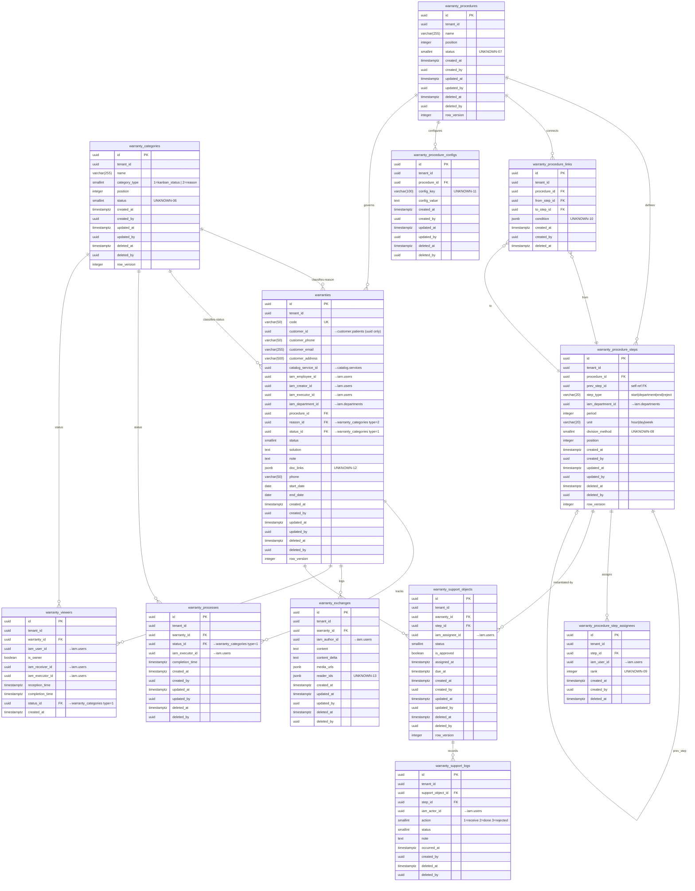

# WARRANTY_DATABASE.md
## CareFollow Platform — Warranty Bounded Context: Database Design

**Version:** 1.0.0
**Status:** DRAFT — Pending DDD_MODEL.md confirmation
**Scope:** `warranty` PostgreSQL schema only
**Date:** 2026-06-01

> **Source Notice:** Reverse-engineered from `src/model/warranty*/`, `src/services/WarrantyService.ts`, `src/pages/Warranty/`, and `src/configs/urls.ts`. Warranty shares `SupportCommonService` with Ticket at the runtime layer (`objectType: 2`), but in this DDD schema design the warranty context owns all its execution tables independently. All claims tagged **CONFIRMED**, **INFERRED**, or **UNKNOWN**.

---

## Table of Contents

1. [Context Overview](#1-context-overview)
2. [Aggregate Design](#2-aggregate-design)
3. [ERD — Mermaid](#3-erd--mermaid)
4. [SQL DDL](#4-sql-ddl)
5. [Indexes](#5-indexes)
6. [Prisma Schema](#6-prisma-schema)
7. [Unknown Registry](#7-unknown-registry)

---

## 1. Context Overview

### 1.1 Purpose

The **Warranty context** (`warranty` schema) owns all entities related to customer warranty claims, their Kanban-based status tracking, multi-step approval procedures, and the execution log of those procedures.

### 1.2 Boundary

**Owned by this context:**

| Concept | Vietnamese | Notes |
|---|---|---|
| Warranty claim | Phiếu bảo hành | Aggregate root |
| Warranty Kanban status | Trạng thái bảo hành (type=1) | Column in Kanban board |
| Warranty reason | Lý do bảo hành (type=2) | Classification of claim |
| Warranty procedure | Quy trình bảo hành | Multi-step approval template |
| Procedure step | Bước xử lý | Node in the workflow graph |
| Procedure execution | Phân công xử lý | Step assignment per warranty |
| Procedure log | Nhật ký xử lý | Append-only action audit trail |
| Warranty exchange | Trao đổi bảo hành | Internal chat per claim |
| Warranty viewer | Người xem | Access control list per claim |
| Warranty process | Tiến trình bảo hành | Kanban card movement tracker |

**Out of scope — UUID cross-context references only:**

| Concept | Owned By |
|---|---|
| Customer / Patient profile | `customer` schema |
| User identity | `iam` schema |
| Department definitions | `iam` schema |
| Service / product catalog | `catalog` schema |
| Ticket (bảo hành ≠ hỗ trợ) | `ticket` schema — separate context |

### 1.3 Key Observation: Runtime vs. Design-time Sharing

At runtime, Warranty uses the shared `/supportObject` and `/supportLog` APIs with `objectType: 2` (Ticket uses `objectType: 1`). In this DDD schema design, these are **modelled as owned tables** within the `warranty` schema (`warranty_support_objects`, `warranty_support_logs`) to ensure context sovereignty and microservice extractability. The legacy `objectType` discriminator is not carried forward.

### 1.4 WarrantyCategory Dual Role — CONFIRMED

`warranty_categories` serves two distinct purposes distinguished by `category_type`:

| `category_type` | Domain Meaning | Used As |
|---|---|---|
| `1` | Kanban status column | `warranties.status_id` (board column) and `warranty_processes.status_id` (card movement) |
| `2` | Warranty reason / cause | `warranties.reason_id` (why the claim was raised) |

> **INFERRED:** These could be split into `warranty_kanban_statuses` and `warranty_reasons` for cleaner DDD. Kept as a single table to mirror confirmed system behaviour. Pending DDD_MODEL.md decision (UNKNOWN-01).

### 1.5 Status Reference (CONFIRMED from UI source)

**Warranty main `status` column:**

| Value | Label (VN) | Label (EN) |
|---|---|---|
| `0` | Chưa thực hiện | Not started |
| `1` | Đang thực hiện | In progress |
| `2` | Đã hoàn thành | Completed |
| `3` | Đã hủy | Cancelled |
| `4` | Tạm dừng | Paused |

**`warranty_support_logs.status` column:**

| Value | Label (VN) | Label (EN) |
|---|---|---|
| `0` | Chờ tiếp nhận | Pending receipt |
| `1` | Đang thực hiện | In progress |
| `2` | Hoàn thành | Done |
| `3` | Hủy / Từ chối | Cancelled / Rejected |

**`warranty_support_logs.action` column:**

| Value | Label (VN) | Label (EN) |
|---|---|---|
| `1` | Tiếp nhận | Receive |
| `2` | Hoàn thành | Done |
| `3` | Từ chối | Rejected |

---

## 2. Aggregate Design

### 2.1 Aggregate Map

```
warranty schema
│
├── [AG-01] Warranty Aggregate  (Phiếu bảo hành)
│   ├── Root:     warranties
│   ├── Entities: warranty_processes    (Kanban card movement)
│   │             warranty_exchanges    (internal chat)
│   │             warranty_viewers      (access control)
│   └── Invariants:
│         • status transitions: 0→1→2, 1→4, 4→1, any→3 [CONFIRMED from UI]
│         • endDate must be ≥ startDate [INFERRED]
│         • customer_id OR phone must be non-null [INFERRED]
│         • A warranty may link to at most one procedure_id [CONFIRMED]
│         • reason_id must point to warranty_categories.category_type = 2 [CONFIRMED]
│         • status_id must point to warranty_categories.category_type = 1 [CONFIRMED]
│         • Procedure cannot be changed after execution begins [UNKNOWN-02]
│
├── [AG-02] WarrantyProcedure Aggregate  (Quy trình bảo hành)
│   ├── Root:     warranty_procedures    (maps to /support API type=2)
│   ├── Entities: warranty_procedure_steps
│   │             warranty_procedure_step_assignees
│   │             warranty_procedure_links
│   │             warranty_procedure_configs
│   └── Invariants:
│         • A procedure must have exactly one Start node [CONFIRMED]
│         • A procedure must have at least one End node [CONFIRMED]
│         • A procedure may have one Reject node [CONFIRMED]
│         • step.period + step.unit define the SLA for that step [INFERRED]
│         • An active procedure cannot be structurally modified [UNKNOWN-03]
│
├── [AG-03] ProcedureExecution Aggregate  (execution instance per warranty)
│   ├── Root:     warranty_support_objects
│   ├── Entities: warranty_support_logs  (append-only audit trail)
│   └── Invariants:
│         • Created when a warranty is initialized with a procedure [CONFIRMED]
│         • One support_object per procedure step per warranty [INFERRED]
│         • resetTransferVotes resets a support_object to pending [CONFIRMED]
│         • Only the assigned employee may act on their object [UNKNOWN-04]
│
└── [AG-04] WarrantyCategory Aggregate  (dual-purpose reference data)
    ├── Root:     warranty_categories
    └── Invariants:
          • category_type IN (1, 2) [CONFIRMED]
          • name must be unique per tenant per category_type [INFERRED]
          • Deleting a type=1 category requires migrating warranties that reference it [UNKNOWN-05]
```

### 2.2 Cross-Context UUID References

All columns below are `uuid NOT NULL` or `uuid NULL`. **No foreign key constraints.** No `@relation` in Prisma.

| Table | Column | Target Context | Target Entity |
|---|---|---|---|
| `warranties` | `customer_id` | `customer` | `patients` |
| `warranties` | `catalog_service_id` | `catalog` | `services` |
| `warranties` | `iam_employee_id` | `iam` | `users` (handler) |
| `warranties` | `iam_creator_id` | `iam` | `users` (creator) |
| `warranties` | `iam_executor_id` | `iam` | `users` (executor) |
| `warranties` | `iam_department_id` | `iam` | `departments` |
| `warranty_procedure_steps` | `iam_department_id` | `iam` | `departments` |
| `warranty_procedure_step_assignees` | `iam_user_id` | `iam` | `users` |
| `warranty_processes` | `iam_executor_id` | `iam` | `users` |
| `warranty_exchanges` | `iam_author_id` | `iam` | `users` |
| `warranty_viewers` | `iam_user_id` | `iam` | `users` |
| `warranty_support_objects` | `iam_assignee_id` | `iam` | `users` |
| `warranty_support_logs` | `iam_actor_id` | `iam` | `users` |

---

## 3. ERD — Mermaid



---

## 4. SQL DDL

```sql
-- ============================================================
-- WARRANTY SCHEMA BOOTSTRAP
-- ============================================================
CREATE SCHEMA IF NOT EXISTS warranty;

-- ============================================================
-- AG-04: WarrantyCategory  (dual-purpose: kanban statuses + reasons)
-- category_type = 1 → Kanban status columns (board columns)
-- category_type = 2 → Warranty reasons (why claim was raised)
-- ============================================================
CREATE TABLE warranty.warranty_categories (
    id              UUID         NOT NULL DEFAULT gen_random_uuid(),
    tenant_id       UUID         NOT NULL,
    name            VARCHAR(255) NOT NULL,
    category_type   SMALLINT     NOT NULL
                        CHECK (category_type IN (1, 2)),
    position        INTEGER      NOT NULL DEFAULT 0,
    status          SMALLINT     NOT NULL DEFAULT 1,   -- UNKNOWN-06: active/inactive values
    created_at      TIMESTAMPTZ  NOT NULL DEFAULT now(),
    created_by      UUID         NOT NULL,
    updated_at      TIMESTAMPTZ  NOT NULL DEFAULT now(),
    updated_by      UUID         NOT NULL,
    deleted_at      TIMESTAMPTZ,
    deleted_by      UUID,
    row_version     INTEGER      NOT NULL DEFAULT 1,

    CONSTRAINT pk_warranty_categories PRIMARY KEY (id)
);

COMMENT ON TABLE  warranty.warranty_categories IS
    'AG-04: Dual-purpose reference data. category_type=1: Kanban board columns. category_type=2: Claim reason classification.';
COMMENT ON COLUMN warranty.warranty_categories.category_type IS
    'CONFIRMED: 1=kanban_status (board column), 2=reason (lý do bảo hành).';
COMMENT ON COLUMN warranty.warranty_categories.status IS
    'UNKNOWN-06: active/inactive status values not confirmed in DDD_MODEL.md.';

-- ============================================================
-- AG-02: WarrantyProcedure  (quy trình bảo hành)
-- Maps to the shared /support API filtered by type=2.
-- ============================================================
CREATE TABLE warranty.warranty_procedures (
    id              UUID         NOT NULL DEFAULT gen_random_uuid(),
    tenant_id       UUID         NOT NULL,
    name            VARCHAR(255) NOT NULL,
    position        INTEGER      NOT NULL DEFAULT 0,
    status          SMALLINT     NOT NULL DEFAULT 1,   -- UNKNOWN-07: active/inactive values
    created_at      TIMESTAMPTZ  NOT NULL DEFAULT now(),
    created_by      UUID         NOT NULL,
    updated_at      TIMESTAMPTZ  NOT NULL DEFAULT now(),
    updated_by      UUID         NOT NULL,
    deleted_at      TIMESTAMPTZ,
    deleted_by      UUID,
    row_version     INTEGER      NOT NULL DEFAULT 1,

    CONSTRAINT pk_warranty_procedures PRIMARY KEY (id)
);

COMMENT ON TABLE warranty.warranty_procedures IS
    'AG-02: Procedure template (quy trình bảo hành). Maps to /support API type=2. A Warranty references one procedure.';

-- ============================================================
-- AG-02: WarrantyProcedureStep  (bước xử lý)
-- step_type replaces legacy sentinel departmentId values:
--   0  → 'start'      (node Bắt đầu)
--   -1 → 'end'        (node Hoàn thành)
--   -2 → 'reject'     (node Từ chối)
--   UUID → 'department' (regular department step)
-- ============================================================
CREATE TABLE warranty.warranty_procedure_steps (
    id                  UUID         NOT NULL DEFAULT gen_random_uuid(),
    tenant_id           UUID         NOT NULL,
    procedure_id        UUID         NOT NULL,
    prev_step_id        UUID,                   -- self-referential
    step_type           VARCHAR(20)  NOT NULL
                            CHECK (step_type IN ('start', 'department', 'end', 'reject')),
    iam_department_id   UUID,                   -- → iam.departments; NULL for start/end/reject
    period              INTEGER,
    unit                VARCHAR(20)
                            CHECK (unit IN ('hour', 'day', 'week') OR unit IS NULL),
    division_method     SMALLINT,               -- UNKNOWN-08
    position            INTEGER      NOT NULL DEFAULT 0,
    created_at          TIMESTAMPTZ  NOT NULL DEFAULT now(),
    created_by          UUID         NOT NULL,
    updated_at          TIMESTAMPTZ  NOT NULL DEFAULT now(),
    updated_by          UUID         NOT NULL,
    deleted_at          TIMESTAMPTZ,
    deleted_by          UUID,
    row_version         INTEGER      NOT NULL DEFAULT 1,

    CONSTRAINT pk_warranty_procedure_steps PRIMARY KEY (id),
    CONSTRAINT fk_wps_procedure
        FOREIGN KEY (procedure_id)
        REFERENCES warranty.warranty_procedures(id)
        ON DELETE CASCADE,
    CONSTRAINT fk_wps_prev_step
        FOREIGN KEY (prev_step_id)
        REFERENCES warranty.warranty_procedure_steps(id)
        ON DELETE SET NULL,
    CONSTRAINT ck_wps_dept_required
        CHECK (
            (step_type = 'department' AND iam_department_id IS NOT NULL)
            OR
            (step_type IN ('start', 'end', 'reject') AND iam_department_id IS NULL)
        )
);

COMMENT ON COLUMN warranty.warranty_procedure_steps.step_type IS
    'Replaces legacy sentinel departmentId: 0→start, -1→end, -2→reject. Regular steps use ''department''.';
COMMENT ON COLUMN warranty.warranty_procedure_steps.iam_department_id IS
    'Cross-context ref → iam.departments.id. NULL for start/end/reject nodes. No FK constraint.';
COMMENT ON COLUMN warranty.warranty_procedure_steps.division_method IS
    'UNKNOWN-08: integer controlling employee assignment strategy. Values not confirmed.';

-- ============================================================
-- AG-02: WarrantyProcedureStepAssignee  (normalized from employees JSON)
-- ============================================================
CREATE TABLE warranty.warranty_procedure_step_assignees (
    id              UUID        NOT NULL DEFAULT gen_random_uuid(),
    tenant_id       UUID        NOT NULL,
    step_id         UUID        NOT NULL,
    iam_user_id     UUID        NOT NULL,   -- → iam.users (cross-context, no FK)
    rank            INTEGER     NOT NULL DEFAULT 0,  -- UNKNOWN-09
    created_at      TIMESTAMPTZ NOT NULL DEFAULT now(),
    created_by      UUID        NOT NULL,
    deleted_at      TIMESTAMPTZ,

    CONSTRAINT pk_warranty_procedure_step_assignees PRIMARY KEY (id),
    CONSTRAINT fk_wpsa_step
        FOREIGN KEY (step_id)
        REFERENCES warranty.warranty_procedure_steps(id)
        ON DELETE CASCADE,
    CONSTRAINT uq_wpsa_user_per_step UNIQUE (step_id, iam_user_id)
);

COMMENT ON COLUMN warranty.warranty_procedure_step_assignees.iam_user_id IS
    'Cross-context ref → iam.users.id. Normalized from legacy employees JSON string. No FK constraint.';
COMMENT ON COLUMN warranty.warranty_procedure_step_assignees.rank IS
    'UNKNOWN-09: rank value from legacy {label, value} employee rank structure. Purpose not confirmed.';

-- ============================================================
-- AG-02: WarrantyProcedureLink  (graph edges between steps)
-- ============================================================
CREATE TABLE warranty.warranty_procedure_links (
    id              UUID        NOT NULL DEFAULT gen_random_uuid(),
    tenant_id       UUID        NOT NULL,
    procedure_id    UUID        NOT NULL,
    from_step_id    UUID        NOT NULL,
    to_step_id      UUID        NOT NULL,
    condition       JSONB,                  -- UNKNOWN-10: routing condition
    created_at      TIMESTAMPTZ NOT NULL DEFAULT now(),
    created_by      UUID        NOT NULL,
    deleted_at      TIMESTAMPTZ,

    CONSTRAINT pk_warranty_procedure_links PRIMARY KEY (id),
    CONSTRAINT fk_wpl_procedure
        FOREIGN KEY (procedure_id)
        REFERENCES warranty.warranty_procedures(id)
        ON DELETE CASCADE,
    CONSTRAINT fk_wpl_from_step
        FOREIGN KEY (from_step_id)
        REFERENCES warranty.warranty_procedure_steps(id)
        ON DELETE CASCADE,
    CONSTRAINT fk_wpl_to_step
        FOREIGN KEY (to_step_id)
        REFERENCES warranty.warranty_procedure_steps(id)
        ON DELETE CASCADE,
    CONSTRAINT ck_wpl_no_self_loop
        CHECK (from_step_id <> to_step_id),
    CONSTRAINT uq_wpl_edge UNIQUE (procedure_id, from_step_id, to_step_id)
);

COMMENT ON COLUMN warranty.warranty_procedure_links.condition IS
    'UNKNOWN-10: JSONB routing condition for conditional branching. Shape not confirmed.';

-- ============================================================
-- AG-02: WarrantyProcedureConfig  (procedure-level settings)
-- ============================================================
CREATE TABLE warranty.warranty_procedure_configs (
    id              UUID         NOT NULL DEFAULT gen_random_uuid(),
    tenant_id       UUID         NOT NULL,
    procedure_id    UUID         NOT NULL,
    config_key      VARCHAR(100) NOT NULL,  -- UNKNOWN-11: key names not confirmed
    config_value    TEXT,
    created_at      TIMESTAMPTZ  NOT NULL DEFAULT now(),
    created_by      UUID         NOT NULL,
    updated_at      TIMESTAMPTZ  NOT NULL DEFAULT now(),
    updated_by      UUID         NOT NULL,
    deleted_at      TIMESTAMPTZ,
    deleted_by      UUID,

    CONSTRAINT pk_warranty_procedure_configs PRIMARY KEY (id),
    CONSTRAINT fk_wpc_procedure
        FOREIGN KEY (procedure_id)
        REFERENCES warranty.warranty_procedures(id)
        ON DELETE CASCADE,
    CONSTRAINT uq_wpc_key UNIQUE (procedure_id, config_key)
);

COMMENT ON TABLE warranty.warranty_procedure_configs IS
    'AG-02 entity: Key-value configuration per procedure. UNKNOWN-11: config_key values not confirmed.';

-- ============================================================
-- AG-01: Warranty  (Phiếu bảo hành)
-- ============================================================
CREATE TABLE warranty.warranties (
    id                  UUID         NOT NULL DEFAULT gen_random_uuid(),
    tenant_id           UUID         NOT NULL,
    code                VARCHAR(50)  NOT NULL,

    -- Cross-context refs (UUID only, no FK constraint)
    customer_id         UUID,                   -- → customer.patients
    customer_phone      VARCHAR(50),
    customer_email      VARCHAR(255),
    customer_address    VARCHAR(500),
    catalog_service_id  UUID,                   -- → catalog.services
    iam_employee_id     UUID,                   -- → iam.users (assigned handler)
    iam_creator_id      UUID         NOT NULL,  -- → iam.users (creator)
    iam_executor_id     UUID,                   -- → iam.users (executor)
    iam_department_id   UUID,                   -- → iam.departments

    -- Within-context refs
    procedure_id        UUID,
    reason_id           UUID,        -- → warranty_categories WHERE category_type = 2
    status_id           UUID,        -- → warranty_categories WHERE category_type = 1

    status              SMALLINT     NOT NULL DEFAULT 0
                            CHECK (status IN (0, 1, 2, 3, 4)),
    solution            TEXT,
    note                TEXT,
    doc_links           JSONB,                  -- UNKNOWN-12: attachment array shape
    phone               VARCHAR(50), -- reporter phone, may differ from customer_phone
    start_date          DATE,
    end_date            DATE,
    created_at          TIMESTAMPTZ  NOT NULL DEFAULT now(),
    created_by          UUID         NOT NULL,
    updated_at          TIMESTAMPTZ  NOT NULL DEFAULT now(),
    updated_by          UUID         NOT NULL,
    deleted_at          TIMESTAMPTZ,
    deleted_by          UUID,
    row_version         INTEGER      NOT NULL DEFAULT 1,

    CONSTRAINT pk_warranties PRIMARY KEY (id),
    CONSTRAINT uq_warranties_code UNIQUE (tenant_id, code),
    CONSTRAINT fk_warranties_procedure
        FOREIGN KEY (procedure_id)
        REFERENCES warranty.warranty_procedures(id)
        ON DELETE SET NULL,
    CONSTRAINT fk_warranties_reason
        FOREIGN KEY (reason_id)
        REFERENCES warranty.warranty_categories(id)
        ON DELETE SET NULL,
    CONSTRAINT fk_warranties_status
        FOREIGN KEY (status_id)
        REFERENCES warranty.warranty_categories(id)
        ON DELETE SET NULL,
    CONSTRAINT ck_warranties_dates
        CHECK (end_date IS NULL OR start_date IS NULL OR end_date >= start_date),
    CONSTRAINT ck_warranties_contact
        CHECK (customer_id IS NOT NULL OR phone IS NOT NULL OR customer_phone IS NOT NULL)
);

COMMENT ON COLUMN warranty.warranties.customer_id        IS 'Cross-context ref → customer.patients.id. UUID only, no FK constraint.';
COMMENT ON COLUMN warranty.warranties.catalog_service_id IS 'Cross-context ref → catalog.services.id. UUID only, no FK constraint.';
COMMENT ON COLUMN warranty.warranties.iam_employee_id    IS 'Cross-context ref → iam.users.id. No FK constraint.';
COMMENT ON COLUMN warranty.warranties.iam_creator_id     IS 'Cross-context ref → iam.users.id. No FK constraint.';
COMMENT ON COLUMN warranty.warranties.iam_executor_id    IS 'Cross-context ref → iam.users.id. No FK constraint.';
COMMENT ON COLUMN warranty.warranties.iam_department_id  IS 'Cross-context ref → iam.departments.id. No FK constraint.';
COMMENT ON COLUMN warranty.warranties.reason_id          IS 'FK → warranty_categories WHERE category_type = 2 (lý do bảo hành).';
COMMENT ON COLUMN warranty.warranties.status_id          IS 'FK → warranty_categories WHERE category_type = 1 (Kanban column).';
COMMENT ON COLUMN warranty.warranties.status             IS '0=not_started, 1=in_progress, 2=completed, 3=cancelled, 4=paused. CONFIRMED from UI source.';
COMMENT ON COLUMN warranty.warranties.doc_links          IS 'UNKNOWN-12: JSONB attachment array. Shape: [{url,name,type}] — inferred.';

-- ============================================================
-- AG-01: WarrantyProcess  (Kanban card movement tracker)
-- Tracks movement of a warranty between Kanban columns.
-- Each row = one card movement event with executor assignment.
-- ============================================================
CREATE TABLE warranty.warranty_processes (
    id              UUID        NOT NULL DEFAULT gen_random_uuid(),
    tenant_id       UUID        NOT NULL,
    warranty_id     UUID        NOT NULL,
    status_id       UUID        NOT NULL,    -- → warranty_categories WHERE category_type = 1
    iam_executor_id UUID,                   -- → iam.users (cross-context, no FK)
    completion_time TIMESTAMPTZ,
    created_at      TIMESTAMPTZ NOT NULL DEFAULT now(),
    created_by      UUID        NOT NULL,
    updated_at      TIMESTAMPTZ NOT NULL DEFAULT now(),
    updated_by      UUID        NOT NULL,
    deleted_at      TIMESTAMPTZ,
    deleted_by      UUID,

    CONSTRAINT pk_warranty_processes PRIMARY KEY (id),
    CONSTRAINT fk_wp_warranty
        FOREIGN KEY (warranty_id)
        REFERENCES warranty.warranties(id)
        ON DELETE CASCADE,
    CONSTRAINT fk_wp_status
        FOREIGN KEY (status_id)
        REFERENCES warranty.warranty_categories(id)
        ON DELETE RESTRICT
);

COMMENT ON TABLE  warranty.warranty_processes IS
    'AG-01 entity: Kanban card movement. Created by /warrantyProcess/update. Maps statusId → warranty_categories type=1.';
COMMENT ON COLUMN warranty.warranty_processes.iam_executor_id IS
    'Cross-context ref → iam.users.id. No FK constraint.';

-- ============================================================
-- AG-01: WarrantyExchange  (internal chat)
-- ============================================================
CREATE TABLE warranty.warranty_exchanges (
    id              UUID        NOT NULL DEFAULT gen_random_uuid(),
    tenant_id       UUID        NOT NULL,
    warranty_id     UUID        NOT NULL,
    iam_author_id   UUID        NOT NULL,   -- → iam.users (cross-context, no FK)
    content         TEXT,
    content_delta   TEXT,
    media_urls      JSONB,
    reader_ids      JSONB,                  -- UNKNOWN-13: shape not confirmed
    created_at      TIMESTAMPTZ NOT NULL DEFAULT now(),
    updated_at      TIMESTAMPTZ NOT NULL DEFAULT now(),
    updated_by      UUID        NOT NULL,
    deleted_at      TIMESTAMPTZ,
    deleted_by      UUID,

    CONSTRAINT pk_warranty_exchanges PRIMARY KEY (id),
    CONSTRAINT fk_we_warranty
        FOREIGN KEY (warranty_id)
        REFERENCES warranty.warranties(id)
        ON DELETE CASCADE
);

COMMENT ON COLUMN warranty.warranty_exchanges.iam_author_id IS
    'Cross-context ref → iam.users.id. No FK constraint.';
COMMENT ON COLUMN warranty.warranty_exchanges.reader_ids    IS
    'UNKNOWN-13: JSONB array of iam_user_id UUIDs who have read this message.';

-- ============================================================
-- AG-01: WarrantyViewer  (access control + process participant)
-- The /warranty/viewer endpoint returns enriched data (receiver,
-- executor, receptionTime, completionTime, statusId) suggesting
-- this tracks who is involved at each process stage.
-- ============================================================
CREATE TABLE warranty.warranty_viewers (
    id                  UUID        NOT NULL DEFAULT gen_random_uuid(),
    tenant_id           UUID        NOT NULL,
    warranty_id         UUID        NOT NULL,
    iam_user_id         UUID        NOT NULL,   -- → iam.users (cross-context, no FK)
    is_owner            BOOLEAN     NOT NULL DEFAULT false,
    iam_receiver_id     UUID,                   -- → iam.users (who received the step)
    iam_executor_id     UUID,                   -- → iam.users (who executed the step)
    reception_time      TIMESTAMPTZ,
    completion_time     TIMESTAMPTZ,
    status_id           UUID,   -- → warranty_categories WHERE category_type = 1
    created_at          TIMESTAMPTZ NOT NULL DEFAULT now(),

    CONSTRAINT pk_warranty_viewers PRIMARY KEY (id),
    CONSTRAINT fk_wv_warranty
        FOREIGN KEY (warranty_id)
        REFERENCES warranty.warranties(id)
        ON DELETE CASCADE,
    CONSTRAINT fk_wv_status
        FOREIGN KEY (status_id)
        REFERENCES warranty.warranty_categories(id)
        ON DELETE SET NULL,
    CONSTRAINT uq_warranty_viewer UNIQUE (warranty_id, iam_user_id)
);

COMMENT ON TABLE  warranty.warranty_viewers IS
    'AG-01 entity: Access control + process participant snapshot. Enriched by /warranty/viewer endpoint.';
COMMENT ON COLUMN warranty.warranty_viewers.iam_user_id     IS 'Cross-context ref → iam.users.id. No FK constraint.';
COMMENT ON COLUMN warranty.warranty_viewers.iam_receiver_id IS 'Cross-context ref → iam.users.id. No FK constraint.';
COMMENT ON COLUMN warranty.warranty_viewers.iam_executor_id IS 'Cross-context ref → iam.users.id. No FK constraint.';

-- ============================================================
-- AG-03: WarrantySupportObject  (procedure step instance)
-- Owns the execution state of a procedure step for one warranty.
-- Created when warranty procedure is initialized.
-- Replaces legacy shared supportObject with objectType=2.
-- ============================================================
CREATE TABLE warranty.warranty_support_objects (
    id                  UUID        NOT NULL DEFAULT gen_random_uuid(),
    tenant_id           UUID        NOT NULL,
    warranty_id         UUID        NOT NULL,
    step_id             UUID        NOT NULL,
    iam_assignee_id     UUID,                   -- → iam.users (who took the object)
    status              SMALLINT    NOT NULL DEFAULT 0
                            CHECK (status IN (0, 1, 2, 3)),
    is_approved         BOOLEAN     NOT NULL DEFAULT false,
    assigned_at         TIMESTAMPTZ,
    due_at              TIMESTAMPTZ,
    created_at          TIMESTAMPTZ NOT NULL DEFAULT now(),
    created_by          UUID        NOT NULL,
    updated_at          TIMESTAMPTZ NOT NULL DEFAULT now(),
    updated_by          UUID        NOT NULL,
    deleted_at          TIMESTAMPTZ,
    deleted_by          UUID,
    row_version         INTEGER     NOT NULL DEFAULT 1,

    CONSTRAINT pk_warranty_support_objects PRIMARY KEY (id),
    CONSTRAINT fk_wso_warranty
        FOREIGN KEY (warranty_id)
        REFERENCES warranty.warranties(id)
        ON DELETE RESTRICT,
    CONSTRAINT fk_wso_step
        FOREIGN KEY (step_id)
        REFERENCES warranty.warranty_procedure_steps(id)
        ON DELETE RESTRICT,
    CONSTRAINT uq_wso_step_warranty UNIQUE (warranty_id, step_id)
);

COMMENT ON COLUMN warranty.warranty_support_objects.iam_assignee_id IS
    'Cross-context ref → iam.users.id. Set when employee calls takeObject. No FK constraint.';
COMMENT ON COLUMN warranty.warranty_support_objects.status IS
    '0=pending_receipt, 1=in_progress, 2=done, 3=rejected. CONFIRMED from UI source.';
COMMENT ON COLUMN warranty.warranty_support_objects.due_at IS
    'Deadline: warranty.start_date + step.period + step.unit. Calculated at initialization.';

-- ============================================================
-- AG-03: WarrantySupportLog  (execution audit trail — append-only)
-- Replaces legacy shared supportLog with objectType=2.
-- ============================================================
CREATE TABLE warranty.warranty_support_logs (
    id                  UUID        NOT NULL DEFAULT gen_random_uuid(),
    tenant_id           UUID        NOT NULL,
    support_object_id   UUID        NOT NULL,
    step_id             UUID        NOT NULL,
    iam_actor_id        UUID        NOT NULL,   -- → iam.users (cross-context, no FK)
    action              SMALLINT    NOT NULL
                            CHECK (action IN (1, 2, 3)),
                            -- 1 = receive  (Tiếp nhận)
                            -- 2 = done     (Hoàn thành)
                            -- 3 = rejected (Từ chối)
    status              SMALLINT    NOT NULL
                            CHECK (status IN (0, 1, 2, 3)),
    note                TEXT,
    occurred_at         TIMESTAMPTZ NOT NULL DEFAULT now(),
    created_by          UUID        NOT NULL,
    deleted_at          TIMESTAMPTZ,            -- soft-delete for audit correction only
    deleted_by          UUID,

    CONSTRAINT pk_warranty_support_logs PRIMARY KEY (id),
    CONSTRAINT fk_wsl_support_object
        FOREIGN KEY (support_object_id)
        REFERENCES warranty.warranty_support_objects(id)
        ON DELETE RESTRICT,
    CONSTRAINT fk_wsl_step
        FOREIGN KEY (step_id)
        REFERENCES warranty.warranty_procedure_steps(id)
        ON DELETE RESTRICT
);

COMMENT ON TABLE  warranty.warranty_support_logs IS
    'AG-03 entity: Append-only audit trail of actions on each support_object step.';
COMMENT ON COLUMN warranty.warranty_support_logs.iam_actor_id IS
    'Cross-context ref → iam.users.id. No FK constraint.';
COMMENT ON COLUMN warranty.warranty_support_logs.action IS
    '1=receive (Tiếp nhận), 2=done (Hoàn thành), 3=rejected (Từ chối). CONFIRMED from UI source.';
```

---

## 5. Indexes

### 5.1 Mandatory Soft-Delete Partial Indexes (All Tables)

```sql
-- Pattern: one partial index per domain table.
-- Example — repeat for all tables with deleted_at:

CREATE INDEX CONCURRENTLY idx_warranty_categories_tenant_active
    ON warranty.warranty_categories (tenant_id, category_type)
    WHERE deleted_at IS NULL;

CREATE INDEX CONCURRENTLY idx_warranty_procedures_tenant_active
    ON warranty.warranty_procedures (tenant_id)
    WHERE deleted_at IS NULL;

CREATE INDEX CONCURRENTLY idx_warranties_tenant_active
    ON warranty.warranties (tenant_id)
    WHERE deleted_at IS NULL;
```

### 5.2 Table-Specific Indexes

```sql
-- ── warranties (hottest query paths) ─────────────────────────

-- Primary list filter: status
CREATE INDEX CONCURRENTLY idx_warranties_tenant_status
    ON warranty.warranties (tenant_id, status)
    WHERE deleted_at IS NULL;

-- Customer 360 view lookup
CREATE INDEX CONCURRENTLY idx_warranties_customer
    ON warranty.warranties (tenant_id, customer_id)
    WHERE deleted_at IS NULL AND customer_id IS NOT NULL;

-- Employee workload view
CREATE INDEX CONCURRENTLY idx_warranties_employee
    ON warranty.warranties (tenant_id, iam_employee_id, status)
    WHERE deleted_at IS NULL AND iam_employee_id IS NOT NULL;

-- Department queue
CREATE INDEX CONCURRENTLY idx_warranties_department
    ON warranty.warranties (tenant_id, iam_department_id, status)
    WHERE deleted_at IS NULL AND iam_department_id IS NOT NULL;

-- Procedure-based list (WarrantyListProcess page)
CREATE INDEX CONCURRENTLY idx_warranties_procedure_status
    ON warranty.warranties (tenant_id, procedure_id, status)
    WHERE deleted_at IS NULL AND procedure_id IS NOT NULL;

-- Kanban board column grouping
CREATE INDEX CONCURRENTLY idx_warranties_status_id
    ON warranty.warranties (tenant_id, status_id)
    WHERE deleted_at IS NULL AND status_id IS NOT NULL;

-- Phone lookup (intake form search)
CREATE INDEX CONCURRENTLY idx_warranties_phone
    ON warranty.warranties (tenant_id, customer_phone)
    WHERE deleted_at IS NULL AND customer_phone IS NOT NULL;

-- Date range reporting
CREATE INDEX CONCURRENTLY idx_warranties_dates
    ON warranty.warranties (tenant_id, start_date, end_date)
    WHERE deleted_at IS NULL;

-- Service-based analytics
CREATE INDEX CONCURRENTLY idx_warranties_service
    ON warranty.warranties (tenant_id, catalog_service_id)
    WHERE deleted_at IS NULL AND catalog_service_id IS NOT NULL;

-- ── warranty_categories ───────────────────────────────────────

-- Type-filtered lookup (most common: load all type=1 for Kanban, type=2 for reasons)
CREATE INDEX CONCURRENTLY idx_warranty_categories_type_position
    ON warranty.warranty_categories (tenant_id, category_type, position)
    WHERE deleted_at IS NULL;

-- ── warranty_processes ────────────────────────────────────────

-- Timeline per warranty
CREATE INDEX CONCURRENTLY idx_warranty_processes_warranty
    ON warranty.warranty_processes (warranty_id, created_at DESC)
    WHERE deleted_at IS NULL;

-- Executor workload
CREATE INDEX CONCURRENTLY idx_warranty_processes_executor
    ON warranty.warranty_processes (tenant_id, iam_executor_id)
    WHERE deleted_at IS NULL AND iam_executor_id IS NOT NULL;

-- ── warranty_procedure_steps ──────────────────────────────────

-- All steps for a procedure (graph load)
CREATE INDEX CONCURRENTLY idx_wps_procedure
    ON warranty.warranty_procedure_steps (procedure_id)
    WHERE deleted_at IS NULL;

-- Find start/end/reject nodes quickly
CREATE INDEX CONCURRENTLY idx_wps_procedure_type
    ON warranty.warranty_procedure_steps (procedure_id, step_type)
    WHERE deleted_at IS NULL;

-- ── warranty_procedure_links ──────────────────────────────────

-- Forward edge traversal
CREATE INDEX CONCURRENTLY idx_wpl_from_step
    ON warranty.warranty_procedure_links (procedure_id, from_step_id)
    WHERE deleted_at IS NULL;

-- Reverse edge traversal
CREATE INDEX CONCURRENTLY idx_wpl_to_step
    ON warranty.warranty_procedure_links (procedure_id, to_step_id)
    WHERE deleted_at IS NULL;

-- ── warranty_exchanges ────────────────────────────────────────

-- Chat thread timeline
CREATE INDEX CONCURRENTLY idx_warranty_exchanges_warranty
    ON warranty.warranty_exchanges (warranty_id, created_at DESC)
    WHERE deleted_at IS NULL;

-- ── warranty_support_objects ──────────────────────────────────

-- All execution steps for a warranty
CREATE INDEX CONCURRENTLY idx_wso_warranty_status
    ON warranty.warranty_support_objects (warranty_id, status)
    WHERE deleted_at IS NULL;

-- Assignee inbox (my pending steps)
CREATE INDEX CONCURRENTLY idx_wso_assignee_status
    ON warranty.warranty_support_objects (tenant_id, iam_assignee_id, status)
    WHERE deleted_at IS NULL AND iam_assignee_id IS NOT NULL;

-- SLA breach detection
CREATE INDEX CONCURRENTLY idx_wso_due_at
    ON warranty.warranty_support_objects (tenant_id, due_at, status)
    WHERE deleted_at IS NULL AND status IN (0, 1);

-- ── warranty_support_logs ─────────────────────────────────────

-- Audit trail per support object
CREATE INDEX CONCURRENTLY idx_wsl_support_object
    ON warranty.warranty_support_logs (support_object_id, occurred_at DESC)
    WHERE deleted_at IS NULL;

-- Actor history
CREATE INDEX CONCURRENTLY idx_wsl_actor
    ON warranty.warranty_support_logs (tenant_id, iam_actor_id, occurred_at DESC)
    WHERE deleted_at IS NULL;
```

---

## 6. Prisma Schema

```prisma
// ─────────────────────────────────────────────────────────────
// CareFollow — Warranty Bounded Context
// Prisma Schema: warranty schema
// ─────────────────────────────────────────────────────────────

generator client {
  provider        = "prisma-client-js"
  previewFeatures = ["multiSchema"]
}

datasource db {
  provider = "postgresql"
  url      = env("DATABASE_URL")
  schemas  = ["warranty"]
}

// ─── AG-04: WarrantyCategory ─────────────────────────────────

model WarrantyCategory {
  id            String    @id @default(dbgenerated("gen_random_uuid()")) @db.Uuid
  tenantId      String    @map("tenant_id") @db.Uuid
  name          String    @db.VarChar(255)
  categoryType  Int       @map("category_type") @db.SmallInt
  // CONFIRMED: 1=kanban_status, 2=reason
  position      Int       @default(0)
  status        Int       @default(1) @db.SmallInt  // UNKNOWN-06
  createdAt     DateTime  @default(now()) @map("created_at") @db.Timestamptz
  createdBy     String    @map("created_by") @db.Uuid
  updatedAt     DateTime  @updatedAt @map("updated_at") @db.Timestamptz
  updatedBy     String    @map("updated_by") @db.Uuid
  deletedAt     DateTime? @map("deleted_at") @db.Timestamptz
  deletedBy     String?   @map("deleted_by") @db.Uuid
  rowVersion    Int       @default(1) @map("row_version")

  // Reason FK (type=2)
  warrantiesAsReason  Warranty[] @relation("WarrantyReason")
  // Kanban status FK (type=1)
  warrantiesAsStatus  Warranty[] @relation("WarrantyStatus")
  warrantyProcesses   WarrantyProcess[]
  warrantyViewers     WarrantyViewer[]

  @@schema("warranty")
  @@map("warranty_categories")
}

// ─── AG-02: WarrantyProcedure ────────────────────────────────

model WarrantyProcedure {
  id          String    @id @default(dbgenerated("gen_random_uuid()")) @db.Uuid
  tenantId    String    @map("tenant_id") @db.Uuid
  name        String    @db.VarChar(255)
  position    Int       @default(0)
  status      Int       @default(1) @db.SmallInt  // UNKNOWN-07
  createdAt   DateTime  @default(now()) @map("created_at") @db.Timestamptz
  createdBy   String    @map("created_by") @db.Uuid
  updatedAt   DateTime  @updatedAt @map("updated_at") @db.Timestamptz
  updatedBy   String    @map("updated_by") @db.Uuid
  deletedAt   DateTime? @map("deleted_at") @db.Timestamptz
  deletedBy   String?   @map("deleted_by") @db.Uuid
  rowVersion  Int       @default(1) @map("row_version")

  steps      WarrantyProcedureStep[]
  links      WarrantyProcedureLink[]
  configs    WarrantyProcedureConfig[]
  warranties Warranty[]

  @@schema("warranty")
  @@map("warranty_procedures")
}

model WarrantyProcedureStep {
  id                String    @id @default(dbgenerated("gen_random_uuid()")) @db.Uuid
  tenantId          String    @map("tenant_id") @db.Uuid
  procedureId       String    @map("procedure_id") @db.Uuid
  prevStepId        String?   @map("prev_step_id") @db.Uuid
  stepType          String    @map("step_type") @db.VarChar(20)
  // start | department | end | reject
  iamDepartmentId   String?   @map("iam_department_id") @db.Uuid
  // → iam.departments (no relation)
  period            Int?
  unit              String?   @db.VarChar(20)    // UNKNOWN-08 confirm values
  divisionMethod    Int?      @map("division_method") @db.SmallInt  // UNKNOWN-08
  position          Int       @default(0)
  createdAt         DateTime  @default(now()) @map("created_at") @db.Timestamptz
  createdBy         String    @map("created_by") @db.Uuid
  updatedAt         DateTime  @updatedAt @map("updated_at") @db.Timestamptz
  updatedBy         String    @map("updated_by") @db.Uuid
  deletedAt         DateTime? @map("deleted_at") @db.Timestamptz
  deletedBy         String?   @map("deleted_by") @db.Uuid
  rowVersion        Int       @default(1) @map("row_version")

  procedure      WarrantyProcedure                @relation(fields: [procedureId], references: [id])
  prevStep       WarrantyProcedureStep?            @relation("StepChain", fields: [prevStepId], references: [id])
  nextSteps      WarrantyProcedureStep[]           @relation("StepChain")
  assignees      WarrantyProcedureStepAssignee[]
  linksFrom      WarrantyProcedureLink[]           @relation("LinkFrom")
  linksTo        WarrantyProcedureLink[]           @relation("LinkTo")
  supportObjects WarrantySupportObject[]

  @@schema("warranty")
  @@map("warranty_procedure_steps")
}

model WarrantyProcedureStepAssignee {
  id          String    @id @default(dbgenerated("gen_random_uuid()")) @db.Uuid
  tenantId    String    @map("tenant_id") @db.Uuid
  stepId      String    @map("step_id") @db.Uuid
  iamUserId   String    @map("iam_user_id") @db.Uuid  // → iam.users (no relation)
  rank        Int       @default(0)                    // UNKNOWN-09
  createdAt   DateTime  @default(now()) @map("created_at") @db.Timestamptz
  createdBy   String    @map("created_by") @db.Uuid
  deletedAt   DateTime? @map("deleted_at") @db.Timestamptz

  step WarrantyProcedureStep @relation(fields: [stepId], references: [id])

  @@unique([stepId, iamUserId])
  @@schema("warranty")
  @@map("warranty_procedure_step_assignees")
}

model WarrantyProcedureLink {
  id            String    @id @default(dbgenerated("gen_random_uuid()")) @db.Uuid
  tenantId      String    @map("tenant_id") @db.Uuid
  procedureId   String    @map("procedure_id") @db.Uuid
  fromStepId    String    @map("from_step_id") @db.Uuid
  toStepId      String    @map("to_step_id") @db.Uuid
  condition     Json?     // UNKNOWN-10
  createdAt     DateTime  @default(now()) @map("created_at") @db.Timestamptz
  createdBy     String    @map("created_by") @db.Uuid
  deletedAt     DateTime? @map("deleted_at") @db.Timestamptz

  procedure WarrantyProcedure    @relation(fields: [procedureId], references: [id])
  fromStep  WarrantyProcedureStep @relation("LinkFrom", fields: [fromStepId], references: [id])
  toStep    WarrantyProcedureStep @relation("LinkTo", fields: [toStepId], references: [id])

  @@unique([procedureId, fromStepId, toStepId])
  @@schema("warranty")
  @@map("warranty_procedure_links")
}

model WarrantyProcedureConfig {
  id          String    @id @default(dbgenerated("gen_random_uuid()")) @db.Uuid
  tenantId    String    @map("tenant_id") @db.Uuid
  procedureId String    @map("procedure_id") @db.Uuid
  configKey   String    @map("config_key") @db.VarChar(100)  // UNKNOWN-11
  configValue String?   @map("config_value")
  createdAt   DateTime  @default(now()) @map("created_at") @db.Timestamptz
  createdBy   String    @map("created_by") @db.Uuid
  updatedAt   DateTime  @updatedAt @map("updated_at") @db.Timestamptz
  updatedBy   String    @map("updated_by") @db.Uuid
  deletedAt   DateTime? @map("deleted_at") @db.Timestamptz
  deletedBy   String?   @map("deleted_by") @db.Uuid

  procedure WarrantyProcedure @relation(fields: [procedureId], references: [id])

  @@unique([procedureId, configKey])
  @@schema("warranty")
  @@map("warranty_procedure_configs")
}

// ─── AG-01: Warranty ─────────────────────────────────────────

model Warranty {
  id                String    @id @default(dbgenerated("gen_random_uuid()")) @db.Uuid
  tenantId          String    @map("tenant_id") @db.Uuid
  code              String    @db.VarChar(50)

  // Cross-context UUID refs — no @relation, no FK constraint
  customerId        String?   @map("customer_id") @db.Uuid      // → customer.patients
  customerPhone     String?   @map("customer_phone") @db.VarChar(50)
  customerEmail     String?   @map("customer_email") @db.VarChar(255)
  customerAddress   String?   @map("customer_address") @db.VarChar(500)
  catalogServiceId  String?   @map("catalog_service_id") @db.Uuid // → catalog.services
  iamEmployeeId     String?   @map("iam_employee_id") @db.Uuid  // → iam.users
  iamCreatorId      String    @map("iam_creator_id") @db.Uuid   // → iam.users
  iamExecutorId     String?   @map("iam_executor_id") @db.Uuid  // → iam.users
  iamDepartmentId   String?   @map("iam_department_id") @db.Uuid // → iam.departments

  // Within-context refs
  procedureId       String?   @map("procedure_id") @db.Uuid
  reasonId          String?   @map("reason_id") @db.Uuid  // → warranty_categories type=2
  statusId          String?   @map("status_id") @db.Uuid  // → warranty_categories type=1

  status            Int       @default(0) @db.SmallInt
  // 0=not_started 1=in_progress 2=completed 3=cancelled 4=paused
  solution          String?
  note              String?
  docLinks          Json?     @map("doc_links")   // UNKNOWN-12
  phone             String?   @db.VarChar(50)
  startDate         DateTime? @map("start_date") @db.Date
  endDate           DateTime? @map("end_date") @db.Date
  createdAt         DateTime  @default(now()) @map("created_at") @db.Timestamptz
  createdBy         String    @map("created_by") @db.Uuid
  updatedAt         DateTime  @updatedAt @map("updated_at") @db.Timestamptz
  updatedBy         String    @map("updated_by") @db.Uuid
  deletedAt         DateTime? @map("deleted_at") @db.Timestamptz
  deletedBy         String?   @map("deleted_by") @db.Uuid
  rowVersion        Int       @default(1) @map("row_version")

  procedure      WarrantyProcedure?  @relation(fields: [procedureId], references: [id])
  reason         WarrantyCategory?   @relation("WarrantyReason", fields: [reasonId], references: [id])
  statusCategory WarrantyCategory?   @relation("WarrantyStatus", fields: [statusId], references: [id])
  processes      WarrantyProcess[]
  exchanges      WarrantyExchange[]
  viewers        WarrantyViewer[]
  supportObjects WarrantySupportObject[]

  @@unique([tenantId, code])
  @@schema("warranty")
  @@map("warranties")
}

model WarrantyProcess {
  id              String    @id @default(dbgenerated("gen_random_uuid()")) @db.Uuid
  tenantId        String    @map("tenant_id") @db.Uuid
  warrantyId      String    @map("warranty_id") @db.Uuid
  statusId        String    @map("status_id") @db.Uuid
  iamExecutorId   String?   @map("iam_executor_id") @db.Uuid  // → iam.users (no relation)
  completionTime  DateTime? @map("completion_time") @db.Timestamptz
  createdAt       DateTime  @default(now()) @map("created_at") @db.Timestamptz
  createdBy       String    @map("created_by") @db.Uuid
  updatedAt       DateTime  @updatedAt @map("updated_at") @db.Timestamptz
  updatedBy       String    @map("updated_by") @db.Uuid
  deletedAt       DateTime? @map("deleted_at") @db.Timestamptz
  deletedBy       String?   @map("deleted_by") @db.Uuid

  warranty WarrantyCategory @relation(fields: [statusId], references: [id])
  // Note: warrantyId FK declared below after Warranty model
  warrantyRef Warranty @relation(fields: [warrantyId], references: [id])

  @@schema("warranty")
  @@map("warranty_processes")
}

model WarrantyExchange {
  id           String    @id @default(dbgenerated("gen_random_uuid()")) @db.Uuid
  tenantId     String    @map("tenant_id") @db.Uuid
  warrantyId   String    @map("warranty_id") @db.Uuid
  iamAuthorId  String    @map("iam_author_id") @db.Uuid  // → iam.users (no relation)
  content      String?
  contentDelta String?   @map("content_delta")
  mediaUrls    Json?     @map("media_urls")
  readerIds    Json?     @map("reader_ids")               // UNKNOWN-13
  createdAt    DateTime  @default(now()) @map("created_at") @db.Timestamptz
  updatedAt    DateTime  @updatedAt @map("updated_at") @db.Timestamptz
  updatedBy    String    @map("updated_by") @db.Uuid
  deletedAt    DateTime? @map("deleted_at") @db.Timestamptz
  deletedBy    String?   @map("deleted_by") @db.Uuid

  warranty Warranty @relation(fields: [warrantyId], references: [id])

  @@schema("warranty")
  @@map("warranty_exchanges")
}

model WarrantyViewer {
  id              String    @id @default(dbgenerated("gen_random_uuid()")) @db.Uuid
  tenantId        String    @map("tenant_id") @db.Uuid
  warrantyId      String    @map("warranty_id") @db.Uuid
  iamUserId       String    @map("iam_user_id") @db.Uuid      // → iam.users (no relation)
  isOwner         Boolean   @default(false) @map("is_owner")
  iamReceiverId   String?   @map("iam_receiver_id") @db.Uuid  // → iam.users (no relation)
  iamExecutorId   String?   @map("iam_executor_id") @db.Uuid  // → iam.users (no relation)
  receptionTime   DateTime? @map("reception_time") @db.Timestamptz
  completionTime  DateTime? @map("completion_time") @db.Timestamptz
  statusId        String?   @map("status_id") @db.Uuid
  createdAt       DateTime  @default(now()) @map("created_at") @db.Timestamptz

  warranty       Warranty          @relation(fields: [warrantyId], references: [id])
  statusCategory WarrantyCategory? @relation(fields: [statusId], references: [id])

  @@unique([warrantyId, iamUserId])
  @@schema("warranty")
  @@map("warranty_viewers")
}

// ─── AG-03: ProcedureExecution ───────────────────────────────

model WarrantySupportObject {
  id              String    @id @default(dbgenerated("gen_random_uuid()")) @db.Uuid
  tenantId        String    @map("tenant_id") @db.Uuid
  warrantyId      String    @map("warranty_id") @db.Uuid
  stepId          String    @map("step_id") @db.Uuid
  iamAssigneeId   String?   @map("iam_assignee_id") @db.Uuid  // → iam.users (no relation)
  status          Int       @default(0) @db.SmallInt
  // 0=pending_receipt 1=in_progress 2=done 3=rejected
  isApproved      Boolean   @default(false) @map("is_approved")
  assignedAt      DateTime? @map("assigned_at") @db.Timestamptz
  dueAt           DateTime? @map("due_at") @db.Timestamptz
  createdAt       DateTime  @default(now()) @map("created_at") @db.Timestamptz
  createdBy       String    @map("created_by") @db.Uuid
  updatedAt       DateTime  @updatedAt @map("updated_at") @db.Timestamptz
  updatedBy       String    @map("updated_by") @db.Uuid
  deletedAt       DateTime? @map("deleted_at") @db.Timestamptz
  deletedBy       String?   @map("deleted_by") @db.Uuid
  rowVersion      Int       @default(1) @map("row_version")

  warranty WarrantyProcedureStep @relation(fields: [stepId], references: [id])
  // warrantyId FK
  warrantyRef WarrantyProcedureStep @relation(fields: [stepId], references: [id])
  logs        WarrantySupportLog[]

  // Note: warrantyId and stepId declared as true relations above
  warrantyEntity Warranty              @relation(fields: [warrantyId], references: [id])
  step           WarrantyProcedureStep @relation(fields: [stepId], references: [id])

  @@unique([warrantyId, stepId])
  @@schema("warranty")
  @@map("warranty_support_objects")
}

model WarrantySupportLog {
  id              String    @id @default(dbgenerated("gen_random_uuid()")) @db.Uuid
  tenantId        String    @map("tenant_id") @db.Uuid
  supportObjectId String    @map("support_object_id") @db.Uuid
  stepId          String    @map("step_id") @db.Uuid
  iamActorId      String    @map("iam_actor_id") @db.Uuid  // → iam.users (no relation)
  action          Int       @db.SmallInt
  // 1=receive, 2=done, 3=rejected
  status          Int       @db.SmallInt
  // 0=pending, 1=in_progress, 2=done, 3=rejected
  note            String?
  occurredAt      DateTime  @default(now()) @map("occurred_at") @db.Timestamptz
  createdBy       String    @map("created_by") @db.Uuid
  deletedAt       DateTime? @map("deleted_at") @db.Timestamptz
  deletedBy       String?   @map("deleted_by") @db.Uuid

  supportObject WarrantySupportObject @relation(fields: [supportObjectId], references: [id])
  step          WarrantyProcedureStep @relation(fields: [stepId], references: [id])

  @@schema("warranty")
  @@map("warranty_support_logs")
}
```

---

## 7. Unknown Registry

| ID | Description | Impact | Resolution |
|---|---|---|---|
| UNKNOWN-01 | Should `warranty_categories` be split into `warranty_kanban_statuses` (type=1) and `warranty_reasons` (type=2)? Currently one table with `category_type` discriminator. | Schema refactor decision | DDD_MODEL.md |
| UNKNOWN-02 | Can a warranty's `procedure_id` be changed after `warranty_support_objects` have been created? | Write guard | DDD_MODEL.md |
| UNKNOWN-03 | Can a `WarrantyProcedure`'s steps be modified while warranties are actively using it? | Migration safety rule | DDD_MODEL.md |
| UNKNOWN-04 | Can any employee act on a `warranty_support_object`, or only the `iam_assignee_id`? | Authorization rule | DDD_MODEL.md |
| UNKNOWN-05 | Policy for deleting a type=1 `WarrantyCategory` that is referenced by active warranties | Cascade / guard rule | DDD_MODEL.md |
| UNKNOWN-06 | `warranty_categories.status` integer values and meaning (active=1, inactive=0?) | Category filter | DDD_MODEL.md |
| UNKNOWN-07 | `warranty_procedures.status` integer values and meaning | Procedure filter | DDD_MODEL.md |
| UNKNOWN-08 | `division_method` integer values and business meaning (round-robin? manual? rank-based?) | Assignment engine | DDD_MODEL.md |
| UNKNOWN-09 | `rank` value in `warranty_procedure_step_assignees` — purpose and valid values | Assignment priority | DDD_MODEL.md |
| UNKNOWN-10 | `condition` JSONB shape in `warranty_procedure_links` | Routing engine | DDD_MODEL.md |
| UNKNOWN-11 | `config_key` valid values in `warranty_procedure_configs` | Config processing | DDD_MODEL.md |
| UNKNOWN-12 | `doc_links` JSONB exact shape — `[{url, name, type}]`? | File validation | DDD_MODEL.md |
| UNKNOWN-13 | `reader_ids` JSONB exact shape in `warranty_exchanges` — array of UUID strings? | Read-receipt feature | DDD_MODEL.md |

---

*End of WARRANTY_DATABASE.md v1.0.0*
*Next review: Upon receipt of DDD_MODEL.md — resolve UNKNOWN-01 through UNKNOWN-13*
